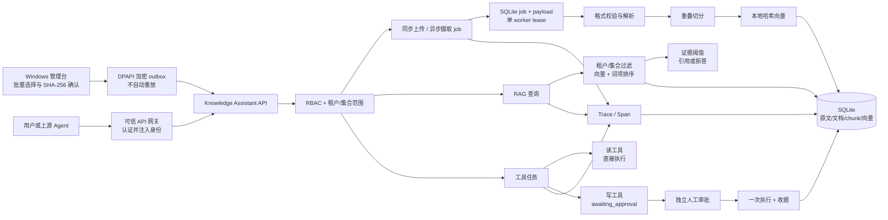
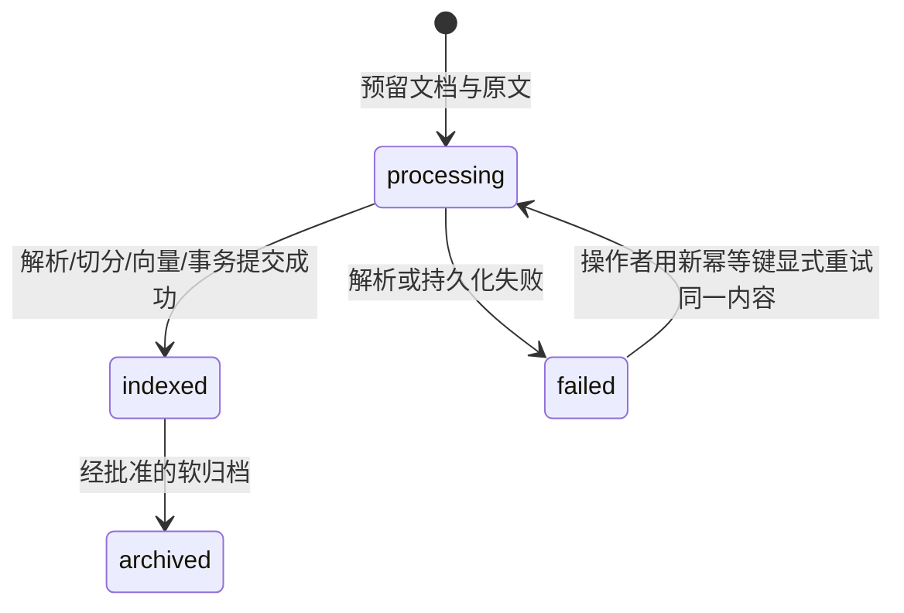
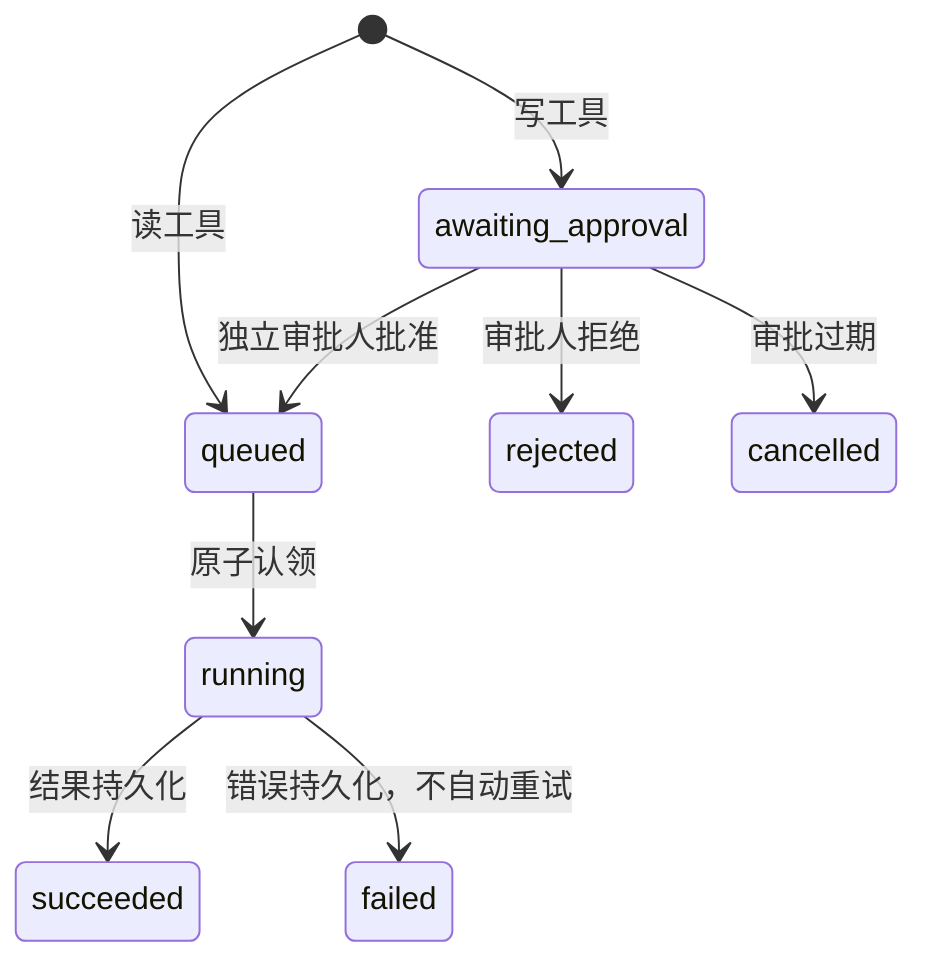
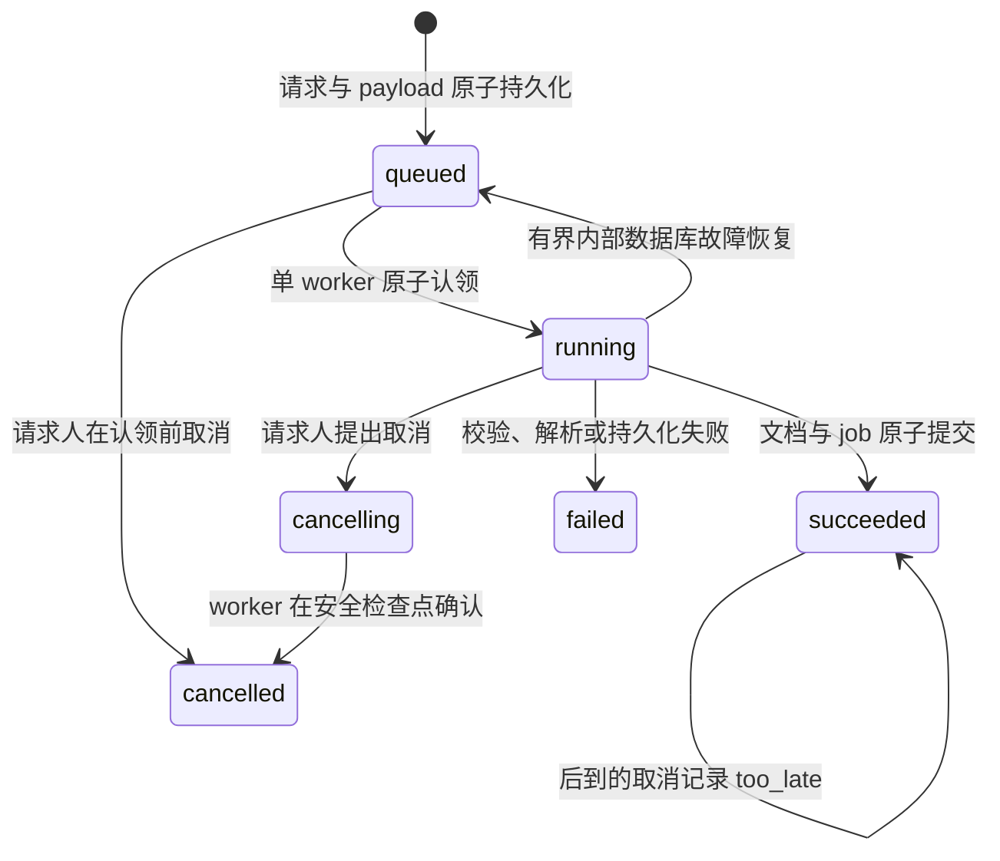

# Table-Miku Knowledge Assistant 2.3 实施与运维手册

> 定位：企业知识库与任务处理 Agent 的可验证纵向切片
> 适用代码：`table_miku/knowledge_assistant/`
> 默认存储：SQLite `knowledge_assistant_2.db`，与桌面端旧知识库和 Agent 数据隔离

## 1. 目标、非目标与证据口径

本模块不是“多个 Agent 互相聊天”的演示。它把 AI 系统拆成可独立审查的知识摄取、检索、权限、任务、审批、幂等和可观测链路，并让每条关键安全边界都能由测试复现。

当前已实现的纵向能力：

| 目标 | 实现 | 可验证证据 |
|---|---|---|
| 文档上传、解析、切分、向量化 | 同步 JSON Base64 上传；2.3 可恢复异步摄取；TXT/Markdown/RST/JSON/PDF 解析；重叠切分；384 维本地哈希向量 | `test_knowledge_assistant_documents.py`、`test_knowledge_assistant_ingestion.py` |
| 桌面批量摄取与失败恢复 | 最多 20 个文件；后台工作线程；真实阶段；请求人取消；DPAPI 加密 outbox；人工安全重放 | `test_knowledge_assistant_desktop_ingestion.py`、`test_knowledge_assistant_outbox.py`、`test_knowledge_assistant_ui.py` |
| RAG、引用、拒答 | 多租户/集合过滤；向量和词项联合排序；阈值拒答；`[S1]` 结构化引用 | `test_knowledge_assistant_rag.py` |
| 工具调用与任务状态 | `query_knowledge`、`ingest_text`、`archive_document`；状态和错误持久化 | `test_knowledge_assistant_tasks.py` |
| 写审批、权限、幂等 | RBAC；请求人与审批人分离；10 分钟审批期限；一次性收据；幂等键冲突返回 409 | 同上 |
| 离线评测 | 固定语料、固定问答、召回/首引/引用覆盖/拒答门禁；金标扩集含冲突与引用忠实度；可 A/B 对比 embedding provider | `test_knowledge_assistant_evals.py`、`evals/run_knowledge_assistant_evals.py` |
| Trace、延迟、Token | Trace + 嵌套 Span；端到端延迟；输入/输出 Token 估算；租户级聚合 | `observability.py` 与 API/测试 |
| 自动化测试与 Docker | pytest、Ruff、CI 离线门禁、非 root 容器、健康检查 | `.github/workflows/ci.yml`、`Dockerfile` |

当前明确不是以下能力：

- 不是大规模向量数据库；一次查询最多扫描当前租户范围内最近的 20,000 个 chunk。
- 不是语义模型效果证明；`local-hash-v1-384` 是离线、确定性的词项哈希向量。
- 不是生成式答案评测；当前回答是可审计的证据摘录组合，不调用 LLM。
- 不是 OCR；只有文本层的 PDF 能被索引。
- 不是完整身份提供商；服务验证 Bearer Token 并消费网关提供的租户/用户/角色头，生产部署必须由可信网关签发和清洗这些头。
- 不是分布式任务队列或多节点数据库；2.3 的文档摄取由当前服务进程中的单 worker 异步执行，工具任务仍在当前进程执行，状态和失败会持久化。

## 2. 总体架构



设计取舍：

1. 新模块使用独立数据库，避免改变旧桌面知识库 schema 或污染用户已有数据。
2. 原始文件保存在 `document_blobs`，解析后的 chunk 和向量在同一数据库中原子提交，便于重新索引和审计。
3. 直接上传是用户主动写操作，需要 `editor`；由 Agent 发起的 `ingest_text`/归档必须进入人工审批。
4. RAG 在证据不足时返回结构化拒答，不让模型凭参数知识补齐。
5. Trace 属性只保存标量元数据，主动丢弃包含 `content`、`prompt`、`password`、`token`、`secret`、`key` 的字段。
6. 桌面端批量摄取在对应网络写入前持久化精确请求；结果未知时只展示恢复选项，不自动重放或生成新幂等键。
7. 异步 worker 先在内存中完成解析、切分和向量准备，再在同一 SQLite 事务中提交文档、chunk、job 终态并删除暂存 payload，避免对外暴露部分索引。

## 3. 数据与状态模型

### 3.1 核心表

| 表 | 用途 | 关键约束 |
|---|---|---|
| `documents` | 文档元数据和处理状态 | `tenant_id + collection_id + checksum` 活跃文档唯一 |
| `document_blobs` | 原始上传内容 | 与文档一对一，文档归档时保留以便恢复 |
| `chunks` | 切分文本和向量 | 文档内 ordinal 唯一；携带租户和集合范围 |
| `tasks` | 工具任务及状态 | `tenant_id + idempotency_key` 唯一 |
| `task_payloads` | 待审批写任务的临时正文 | 完成、拒绝、过期或失败后删除 |
| `approvals` | 人工决策 | 每个写任务只有一个审批对象 |
| `operation_receipts` | 已完成写操作的不可重复收据 | `operation_id` 和 `task_id` 均唯一 |
| `idempotency_records` | 直接上传的幂等响应 | 同 key 不同请求哈希拒绝 |
| `traces` / `spans` | 链路、延迟、Token 和错误 | 读取时强制按 tenant 过滤 |
| `service_metadata` | 稳定服务实例标识 | `service_instance_id` 随数据库持久化，用于恢复记录绑定 |
| `worker_leases` | 摄取 worker 所有权和心跳 | 单一命名 lease；owner fencing 防止两个进程同时提交 |
| `ingestion_jobs` | 异步摄取状态、真实进度、错误与取消结果 | `tenant_id + idempotency_key` 唯一；携带 requester、Trace、document |
| `ingestion_payloads` | 未完成摄取的原始字节 | 与 job 一对一；终态成功、失败或取消后删除 |

SQLite 连接启用：

- `foreign_keys = ON`
- `journal_mode = WAL`
- `busy_timeout = 5000`
- 上下文退出时显式关闭连接，避免 Windows 数据库文件句柄泄漏

### 3.2 文档状态



文档失败会保存有限错误摘要；不会静默退回旧 JSON，也不会把部分 chunk 标记为成功。

### 3.3 任务状态



安全不变量：

- 请求人不能批准或拒绝自己的写任务，即使同时具有 `editor` 和 `approver` 角色。
- 审批人必须先读取专用 Action Preview，再把该预览的 `preview_hash` 原样提交给批准端点；v2 哈希是由服务端专用密钥签发的 HMAC，绑定完整动作、目标、正文、到期时间和当前审批人，客户端不能从普通任务字段自行合成或转交给另一审批人使用。
- 任务读取、预览、批准、拒绝和最终执行都继承 Principal 的集合 allowlist；执行 Principal 只获得该动作的单一目标集合。
- 审批默认 10 分钟过期；过期任务被取消并删除暂存正文。
- 批准只把任务从 `awaiting_approval` 原子推进到 `queued`；同一 `preview_hash` 的并发重复批准返回当前/最终状态，并发执行只有一个认领者和一份收据。
- 写成功后生成以 `task_id` 为 `operation_id` 的唯一收据。
- 写失败没有收据，也不会自动重试；操作者审查失败后必须以新幂等键创建新任务。
- 参数完整性在执行前再次失败时，任务仍持久化为 `failed`；不受集合限制的审计角色可读取脱敏失败状态，集合受限角色在无法证明原集合时失败关闭，任务列表不会被一条损坏记录整体阻断。
- 进程重启时遗留的 `queued`/`running` 任务会以 `interrupted` 失败收口并删除暂存正文；必须先审查可能的局部副作用，再创建新任务。
- 归档是软删除；没有实现危险的物理删除工具。

### 3.4 异步摄取状态



`queued`、`running`、`cancelling` 是活动状态；`succeeded`、`failed`、`cancelled` 是终态。公开 job 同时返回 `progress.phase/current/total`、`attempt_count/max_attempts`、`retryable`、`error_code/error_message`、`trace_id`、`document_id`、`cancel_requested_at` 和 `cancel_outcome`。阶段计数来自真实解析/embedding 工作，不是按时间模拟的百分比。

取消不是撤销已经提交的事务：排队任务会直接转为 `cancelled` 并删除 payload；运行任务先转为 `cancelling`，worker 在解析、逐 chunk embedding 和最终提交前检查。若文档提交已经获胜，job 保持 `succeeded` 且 `cancel_outcome = too_late`。对失败或已取消终态再次请求只记录 `already_terminal`，不会伪造“取消成功”。只有原 `requested_by` 且仍有 `knowledge:write` 和集合权限的身份可以取消。

## 4. 文档摄取

### 4.1 支持范围

| 类型 | 后缀 | 行为 |
|---|---|---|
| 纯文本 | `.txt`、`.rst` | 要求 UTF-8/UTF-8 BOM |
| Markdown | `.md`、`.markdown` | 保留 ATX 标题作为 chunk 元数据 |
| JSON | `.json` | 先严格解析，再格式化后切分 |
| PDF | `.pdf` | 使用 `pypdf` 提取文本并保留页码 |

限制：单文件最大 10 MiB，PDF 最多 500 页，文件名必须是不含目录的纯文件名。加密 PDF、无文本层的扫描 PDF、非 UTF-8 文本和不支持的后缀会明确失败。

### 4.2 切分与向量

- 默认 chunk 最大 900 字符、重叠 120 字符。
- 优先在换行、中文句号、英文句号或空格处切分。
- `local-hash-v1-384` 对英文/数字 token 和中文单字/双字组做带符号 feature hashing，再进行 L2 归一化。
- 向量以 little-endian float32 BLOB 存储，同时保存模型名和维度；模型不匹配的旧向量不会被错误参与查询。
- 相同租户、集合、内容 SHA-256 的活跃文档会去重。

本地哈希向量的优势是离线、无外发、确定性、无额外原生依赖；缺点是不能替代真实语义 embedding。2.4-B 首切片已抽出 `EmbeddingProvider` 协议，并提供可选本地 MiniLM provider（`requirements-ka2-semantic.txt`）与 CI 安全的 `local-bow-v1-384` A/B 对照；**产品默认仍是 `local-hash-v1-384`**。只有金标集上的质量与成本门槛同时通过后才允许切换默认检索，禁止为过门禁而降阈值或删除失败样例。

### 4.3 2.3 可恢复后台摄取

桌面端“批量添加资料”在选择文件后于后台线程建立精确写入范围：文件名、规范化路径、字节数、目标集合和 SHA-256，并显示逐文件进度与可取消预检；未完成用户最终确认前不创建 outbox、不发送网络请求。确认阶段同样在后台重算 SHA-256，部分失败项必须先排除后才能提交。确认快照包含规范路径、大小、纳秒修改时间、设备/文件标识和完整 SHA-256；发送工作线程会从打开的文件句柄重新校验这些字段，并对实际读取字节再次计算 SHA-256。文件在确认后被替换、截断或以相同大小改写都会失败关闭，不会把未确认的新内容发送到服务端。

每个文件独立生成幂等键，并在网络写入前进入本机安全 outbox。服务端 `POST /v1/ingestion-jobs` 只负责原子保存 job 与 payload，返回 HTTP 202；单 worker 随后执行解析、切分、embedding 和最终事务提交。批量中的单个失败不会把其他已确认文件合并成一个不可分割事务。

保护性上限：

| 范围 | 上限 |
|---|---:|
| 一次桌面批量选择 | 20 个文件 |
| 单文件原始内容 | 10 MiB |
| 单 PDF | 500 页 |
| 单 job 提取文本 | 2,000,000 字符 |
| 单 job chunk | 5,000 |
| 每租户活动 job | 100 |
| 全服务活动 job | 1,000 |
| 每租户暂存 payload | 100 MiB |
| 全服务暂存 payload | 512 MiB |
| 本机 outbox | 200 条、256 MiB |

这些是防失控边界，不是容量 SLA。服务端仍把暂存 payload 和最终文档原文放在 SQLite 中；它们没有由 2.3 新增数据库静态加密。高敏感企业资料仍需要磁盘/数据库加密、密钥管理、保留策略和访问审计。

worker 使用数据库 lease、心跳、owner id 与每次运行 token 做 fencing。服务启动时会收口遗留 Trace，并在最多 3 次尝试内重新排队被进程中断或瞬时 SQLite 错误打断的内部执行；达到上限后失败并删除 payload。这个有界内部恢复不等于自动重放用户网络请求：格式错误、权限错误、普通处理失败和桌面端未知网络结果都不会自动创建新 job。

## 5. RAG、引用与拒答

查询流程：

1. 先用 `tenant_id`、授权集合、文档 `indexed` 和 `archived = 0` 做数据库过滤。
2. 对候选 chunk 计算余弦相似度、查询词覆盖率和显著英文/数字锚点覆盖率。
3. 查询包含 `Aurora`、`Redis` 等显著锚点但 chunk 不含任何锚点时，该 chunk 分数归零，防止仅因“内部代号”“租户”等公共词误命中。
4. 默认最高返回 5 条、上限 8 条；低于 0.24 的证据不进入回答。
5. 没有合格证据时返回 `refused = true`、`reason = insufficient_evidence` 和空 citations。
6. 有证据时只拼接截断后的来源摘录，并在每条后添加 `[S1]`；不调用 LLM，不补充来源外事实。

引用对象包括：

```json
{
  "id": "S1",
  "document_id": "doc-...",
  "chunk_id": "chunk-...",
  "filename": "spring.md",
  "collection_id": "engineering",
  "heading": "Spring IoC",
  "page_number": null,
  "excerpt": "Spring IoC 容器通过依赖注入...",
  "score": 0.51,
  "vector_score": 0.43,
  "lexical_score": 0.62
}
```

这证明了“检索与引用契约”，不等于开放域问答质量。接入生成模型时还应加入：引用忠实度判分、提示注入隔离、答案句子到证据的逐句映射、模型版本评测和真实 Token 用量回写。

## 6. 权限模型

### 6.1 角色

| 角色 | 权限 |
|---|---|
| `viewer` | 读知识、读任务、读 Trace |
| `editor` | viewer 能力 + 直接上传 + 创建 Agent 任务 |
| `approver` | 读知识/任务/Trace + 决策他人写任务 |
| `admin` | 全部权限，但仍不能自审批 |

每个 `Principal` 必须携带：

- `tenant_id`：所有文档、chunk、任务、审批和 Trace 的第一过滤键；
- `user_id`：请求、审批和审计主体；
- `roles`：RBAC；
- 可选 `collection_ids`：进一步缩小可读写集合。

服务不会把“查不到”和“另一个租户存在”区分给调用方；跨租户资源统一返回 404。集合越界返回 403。

### 6.2 身份信任边界

API 支持 `KNOWLEDGE_ASSISTANT_API_TOKEN` 的 Bearer Token 比较，并读取：

- `X-Tenant-ID`
- `X-User-ID`
- `X-Roles`，逗号分隔
- 可选 `X-Collection-IDs`，逗号分隔
- 可选 `X-Collection-Scope: restricted`，用于明确表达集合受限身份

没有集合相关头表示可访问该租户内全部集合；出现 `X-Collection-IDs` 或 `X-Collection-Scope: restricted` 但集合列表为空，表示“零集合权限”，不是回退为全部集合。桌面恢复记录会保留这一区别，避免空 allowlist 在重放时扩大权限。

这些身份头本身没有签名。生产部署必须：

1. 外部请求先经过真正的 OIDC/OAuth2/mTLS 网关；
2. 网关删除客户端自带的上述头；
3. 网关根据已验证身份重新注入 tenant/user/role/collection；
4. 服务只暴露在内网，Bearer Token 作为网关到服务的第二道共享凭据；
5. 定期轮换 Token，不写入镜像、Git、日志或 Trace。

直接把容器端口暴露到公网并信任客户端自报角色是不安全的。

## 7. HTTP API

### 7.1 桌面日常可信工作台（2.3）

运行桌面应用：

```powershell
.\.venv\Scripts\python.exe main.py
```

右键 Miku，进入“系统工具”并选择“企业知识助手管理台”。窗口包含：

- **文档**：列出当前租户/集合的文档、查看安全元数据、批量选择并后台索引，以及为现有文档创建归档审批任务；
- **RAG 查询**：默认打开；显示 grounded/refused 状态、安全 Markdown 答案、检索统计、结构化引用、纯文本证据详情和本次 `trace_id`；下一次拒答或查询失败会清空上一次答案与引用，避免来源错配；
- **任务与审批**：任务主视图显示人类可读的动作、目标、状态进度和操作收据，原始 JSON 默认折叠；审批人可主动加载专用 Action Preview、批准/拒绝/暂缓；
- **观测**：显示租户级 Trace/error、平均/P95/最大延迟、Token 估算、operation 聚合，并可按 RAG 返回的 ID 查看 Trace/Span；
- **摄取中心**：显示服务端 job、本地待发送/待确认记录、真实阶段、错误、Trace、文档 ID 和取消结果；只有原请求人可提出取消，待确认请求只能在核对后人工重放或放弃。

首次使用按“上传资料 → 提问 → 核查引用”完成。管理台默认以 Viewer 打开并进入 RAG 查询页；没有资料时前往“文档”，在本地验收环境中展开身份设置并选择 Editor 后上传。Editor 创建写任务后，任务卡片会明确提示等待另一位审批人；必须改用不同用户名的 Approver，加载绑定当前审批人的精确预览后才能批准。身份设置默认折叠，当前已生效角色及能力持续可见；编辑但未应用的身份草稿会冻结业务区并清空受保护视图。

普通 RAG 答案使用受限 GitHub Markdown 阅读器，只展示标题、段落、强调、列表、表格、引用和代码等静态排版。HTML 不执行，Markdown 图片统一替换为“图片已禁用”，本地文件、网络、`data:` 与 `qrc:` 等资源均不加载，链接目标被移除且不能导航。引用详情始终按纯文本显示，并说明相关度只用于排序。此渲染器不用于审批正文：Action Preview 的不可信正文继续逐字、纯文本显示，防止 Markdown 隐藏 URL、伪造后果或改变“所见即所批”的内容。

默认情况下，桌面应用会在操作系统分配的随机 loopback 端口托管一个私有 HTTP API，启动摄取 worker，并生成只保存在进程内存中的随机 Bearer Token。管理台仍经过真实的 JSON、Bearer、身份头、错误码和审批/摄取端点契约，但用户不需要另开 PowerShell 窗口。通过 Table Miku 菜单或托盘发起退出时，会先要求后台摄取和私有服务在安全时限内关闭；仍有只在内存中的未持久化批次或 worker 未停止时，该退出请求会失败关闭并提示稍后重试，而不是静默丢弃。操作系统会话结束、进程强杀或其他直接调用 Qt `quit()` 的路径不能由 `aboutToQuit` 回调否决，必须依赖已经落盘的 outbox 与服务端恢复；2.3 不宣称这些路径可以优雅取消退出。

管理台不会自动复用任何已存在的 `127.0.0.1:8080` 实例。未显式配置外部连接时，如果启动前探测到该端口已有健康的 Knowledge Assistant，管理台会失败关闭并提示用户：先关闭外部服务，或显式提供外部 URL 和与该实例匹配的 Token。该探测只会降低与已知 8080 外部实例错连或共用数据库的风险，不能阻止两个使用随机端口的 Table Miku 进程同时打开同一数据目录。

连接外部实例必须同时显式设置以下两个变量；只设置 URL 或只设置 Token 都不构成有效外部连接配置：

```powershell
$env:KNOWLEDGE_ASSISTANT_DESKTOP_URL = "http://127.0.0.1:8080"
$env:KNOWLEDGE_ASSISTANT_API_TOKEN = "与服务端一致的 Token"
.\.venv\Scripts\python.exe main.py
```

非 loopback 连接必须使用 HTTPS，URL 不允许内嵌用户名、密码、路径、查询或 fragment。桌面客户端禁用环境 HTTP/HTTPS 代理，所有请求均直接连接显式目标，避免 loopback Token 和身份头被代理截获；需要企业代理或网关时，应把可信反向代理作为显式 HTTPS 目标。Token 不写入 `settings.json`、数据库、日志或界面。

审批交互遵循以下安全约束：

1. 管理台默认以 `viewer` 身份打开，不会自动执行上传、创建任务、批准或拒绝。
2. Agent 写任务必须由不同用户的 `approver` 主动加载专用预览；批准按钮在此之前保持禁用。
3. 审批页分成两个只读区域：可信动作契约显示准确目标、来源、`unverified` 标记、SHA-256、字节数、后果和恢复限制；不可信 Agent 原文与契约隔离，并通过 `QPlainTextEdit.setPlainText()` 仅按纯文本显示，不解释 HTML/Markdown，也不被当作界面指令。
4. “暂不处理，保留待审批”是默认焦点；Escape 退出预览并保留 pending，不把关闭误当成终态拒绝。
5. 最终批准还会弹出带目标、后果和可恢复性的二次确认，取消是默认选项；拒绝是另一个明确动作，不需要预览哈希且不会执行知识库写入。
6. 身份字段一旦变化，当前预览立即标记为陈旧并清除内存中的 `preview_hash`，批准/拒绝保持禁用，直到应用身份并重新刷新；选择其他任务、切换身份、暂缓、关闭预览或关闭管理台也会清除审批动作状态。
7. 批准成功后展示不含 ingest 正文的操作收据；拒绝会留下明确终态但不执行知识库写入。普通任务列表和收据区域不会重新显示不可信正文。

界面中的租户、用户、角色和集合输入是为了本地 UAT 复现 RBAC 与职责分离，不是登录系统。生产管理台必须从可信 OIDC/OAuth2/mTLS 网关获得不可编辑身份。当前 Trace/metrics 是租户级语义，无法安全映射到集合级授权：服务端对设置了 `collection_ids` 的身份访问 `GET /v1/metrics` 或 `GET /v1/traces/{trace_id}` 一律返回 `permission_denied`（HTTP 403）。管理台提前禁用观测面板只是改善交互，不是权限边界。

批量摄取与旧的同步写交互采用不同恢复层。直接创建 ingest/归档审批任务的未决请求胶囊仍只存在于当前进程内存；批量摄取则在网络写入前把第一次读取的原始字节、原幂等键、目标集合和原 Principal 写入 DPAPI 加密 outbox。HTTP 408、连接中断、5xx 或畸形 2xx 会留下 `outcome_unknown`，明确的非 408 4xx 会作为确定拒绝收口。未知结果不会自动重放；用户必须用原身份选择“安全重试原请求”，该操作复用完全相同的字节和幂等键，或明确放弃恢复记录。

outbox 使用 Windows CurrentUser DPAPI，记录落盘前刷新文件并以 write-through 替换；中断替换产生的临时文件会保留为不可自动处理的恢复证据。它不保存 API Token 或任意请求 URL。恢复记录同时绑定原租户、用户、角色、集合范围和 `recovery_binding_id`：embedded 模式使用持久化 `service_instance_id`；external 模式使用“规范化 HTTP(S) origin + service_instance_id”的 SHA-256 派生标识，不落盘明文 origin。服务实例、外部 origin 或身份不匹配时不能读取或重放该记录。

摄取中心还会区分本地交付状态与服务端 job 状态：`reading/persisted/sending` 只描述本机阶段，`pending/outcome_unknown` 表示原请求仍可人工核对，`tracking` 表示已知 job 正在跟踪，`cancel_rejected` 表示取消写请求收到确定拒绝，`reconciliation_required` 表示本地已知 job 无法从服务端确认。轮询不会自动重发创建或被拒绝/未知的取消；只有用户再次查看精确目标并明确操作，才会发送一次重放或取消请求。

当前可视化边界：

- API 没有 Trace 列表端点，只能查看本窗口查询返回或人工输入的单个 `trace_id`；
- 批量文档摄取已使用后台 Qt worker 和服务端 job；RAG、任务、审批等其他 HTTP 调用仍可能在 UI 线程同步完成；
- external health 和普通 HTTP 超时仍主要依赖 socket 超时，不是完整的 wall-clock deadline；2.3 没有给所有 API 建立统一取消传播；
- 私有服务仍是 SQLite 单节点原型。需要连接外部服务时必须显式配置桌面 URL 与匹配的 Token；检测到未显式配置的 `127.0.0.1:8080` 实例时失败关闭。当前没有跨进程单实例锁，不要让两个 Table Miku 进程同时使用同一数据目录；
- 批量摄取 outbox 只支持 Windows CurrentUser DPAPI；不可解密、损坏、超出容量或不匹配的记录会保留并失败关闭，不会尝试猜测或自动迁移；
- 服务端只有一个进程内摄取 worker，SQLite lease 只用于防止共享数据库上的重复 worker 提交，不提供分布式吞吐或高可用；
- PDF 解析没有 OCR、恶意文件扫描或隔离沙箱；数据库中的原文、暂存 payload 和 outbox 之外的元数据没有由 2.3 提供应用层静态加密；
- 除内部瞬时 SQLite/中断恢复外，不自动重试失败 job；未知网络结果和恢复 outbox 绝不自动重放；
- 集合受限 Trace 的服务端数据模型尚未实现，因此集合受限身份访问 metrics/Trace 会由服务端返回 403；当前版本不宣称支持集合级观测。

### 7.2 本地启动

完整桌面开发环境：

```powershell
.\.venv\Scripts\python.exe -m table_miku.knowledge_assistant.api --host 127.0.0.1 --port 8080
```

只运行 2.0 服务：

```powershell
python -m venv .venv-ka2
.\.venv-ka2\Scripts\python.exe -m pip install -r requirements-ka2.txt
$env:TABLE_MIKU_DATA_DIR = Join-Path $env:LOCALAPPDATA "TableMiku-KA2"
$env:KNOWLEDGE_ASSISTANT_API_TOKEN = "使用本地生成的长随机值"
.\.venv-ka2\Scripts\python.exe -m table_miku.knowledge_assistant.api
```

健康检查不需要身份：

```powershell
Invoke-RestMethod http://127.0.0.1:8080/health
```

`/health` 同时承担当前单节点服务的摄取 readiness：正常时返回 HTTP 200、`status = ok`、持久化的 `service_instance_id` 和 `ingestion.status = ready`；worker、心跳或数据库 lease 任一不可用时返回 HTTP 503 与 `status = degraded`。调用方不能只检查 TCP 端口或 JSON 可解析就把实例当作可接收摄取任务。`service_instance_id` 是恢复绑定标识，不是认证凭据。

### 7.3 请求头

以下示例假设：

```powershell
$headers = @{
  Authorization = "Bearer $env:KNOWLEDGE_ASSISTANT_API_TOKEN"
  "X-Tenant-ID" = "tenant-demo"
  "X-User-ID" = "alice"
  "X-Roles" = "editor"
}
```

### 7.4 上传文档

`POST /v1/documents` 要求 `editor` 和至少 8 字符的 `Idempotency-Key`：

```powershell
$bytes = [System.IO.File]::ReadAllBytes(".\docs\sample.md")
$body = @{
  filename = "sample.md"
  collection_id = "engineering"
  content_base64 = [Convert]::ToBase64String($bytes)
} | ConvertTo-Json
$uploadHeaders = $headers.Clone()
$uploadHeaders["Idempotency-Key"] = "upload-sample-0001"
Invoke-RestMethod http://127.0.0.1:8080/v1/documents `
  -Method Post -Headers $uploadHeaders -ContentType "application/json" -Body $body
```

同一个租户中，同一幂等键和同一请求返回原响应并标记 `idempotent_replay = true`；同 key 不同请求返回 409。

### 7.5 创建、查看与取消异步摄取

`POST /v1/ingestion-jobs` 要求 `editor`、集合权限和 8–200 字符的 `Idempotency-Key`。请求体与同步上传相同，但成功创建返回 HTTP 202 和持久化 job，不等待解析完成：

```powershell
$ingestionHeaders = $headers.Clone()
$ingestionHeaders["Idempotency-Key"] = "ingestion-sample-0001"
$job = Invoke-RestMethod http://127.0.0.1:8080/v1/ingestion-jobs `
  -Method Post -Headers $ingestionHeaders -ContentType "application/json" -Body $body

Invoke-RestMethod "http://127.0.0.1:8080/v1/ingestion-jobs/$($job.id)" `
  -Headers $headers
```

同一租户内，幂等键永久绑定 job 记录中的请求哈希；同 key、同请求返回原 job 并标记 `idempotent_replay = true`，同 key、不同文件名/集合/内容哈希返回 409。客户端不得因为超时自行换 key，否则会把一次意图变成两个任务。

读取单个或列表要求 `knowledge:read` 并按 tenant/collection 过滤；取消要求 `knowledge:write`，且 `user_id` 必须等于 job 的 `requested_by`：

```powershell
Invoke-RestMethod "http://127.0.0.1:8080/v1/ingestion-jobs/$($job.id)/cancel" `
  -Method Post -Headers $ingestionHeaders
```

取消响应中的 `cancel_outcome` 才是收据语义：`cancelled` 表示已取消，`requested` 表示已记录但仍在处理，`too_late` 表示写入已先完成，`already_terminal` 表示原任务此前已经失败或取消。不要把 HTTP 200 或 `status = cancelling` 展示成“已经撤销”。

### 7.6 查询

`POST /v1/query` 要求 `knowledge:read`：

```powershell
$queryHeaders = $headers.Clone()
$queryHeaders["X-Roles"] = "viewer"
$body = @{
  query = "Spring IoC 的依赖注入解决什么问题？"
  collection_ids = @("engineering")
  top_k = 5
} | ConvertTo-Json
Invoke-RestMethod http://127.0.0.1:8080/v1/query `
  -Method Post -Headers $queryHeaders -ContentType "application/json" -Body $body
```

响应始终含 `answer`、`refused`、`reason`、`citations`、`retrieval` 和 `trace_id`。

### 7.7 创建并审批写工具任务

Agent 以 `editor` 身份创建写任务：

```powershell
$taskHeaders = $headers.Clone()
$taskHeaders["X-User-ID"] = "agent-runtime"
$taskHeaders["Idempotency-Key"] = "agent-write-0001"
$body = @{
  tool_name = "ingest_text"
  arguments = @{
    filename = "agent-note.md"
    collection_id = "engineering"
    content = "# 审批后的知识`n这段内容只有在人工批准后才会进入知识库。"
  }
} | ConvertTo-Json -Depth 5
$task = Invoke-RestMethod http://127.0.0.1:8080/v1/tasks `
  -Method Post -Headers $taskHeaders -ContentType "application/json" -Body $body
```

返回的 `arguments` 只包含文件名、集合、大小和 SHA-256，不回显正文。正文暂存在 `task_payloads`。

另一个用户以 `approver` 身份先读取专用 Action Preview。该端点才会返回待写入的完整 UTF-8 正文，客户端必须将 `action.parameters.content` 当作纯文本显示，不能解释为 HTML/Markdown：

```powershell
$approvalHeaders = $headers.Clone()
$approvalHeaders["X-User-ID"] = "human-reviewer"
$approvalHeaders["X-Roles"] = "approver"
$preview = Invoke-RestMethod `
  "http://127.0.0.1:8080/v1/tasks/$($task.id)/approval-preview" `
  -Method Get -Headers $approvalHeaders

$approvalBody = @{
  preview_hash = $preview.preview_hash
} | ConvertTo-Json
Invoke-RestMethod "http://127.0.0.1:8080/v1/tasks/$($task.id)/approve" `
  -Method Post -Headers $approvalHeaders -ContentType "application/json" -Body $approvalBody
```

预览包含准确目标、来源、后果、恢复语义、原文字节数与 SHA-256。v2 `preview_hash` 使用 HMAC-SHA256 绑定任务、租户、审批对象、隐藏请求哈希、完整 Action Preview、到期时间和 `decision.bound_approver`；普通任务字段不足以伪造它，另一审批人也不能复用。服务端在批准事务和实际执行前都会重验参数、暂存正文及归档目标。普通任务创建、读取、列表、Trace 与错误响应仍不回显正文。拒绝继续使用 `POST /v1/tasks/{id}/reject`，可提交 `{"reason":"证据不足"}`，不要求预览哈希，保持“拒绝即安全”的默认行为。

签名密钥以 32 字节 sidecar 文件保存在数据库旁：`knowledge_assistant_2.db.approval-hmac-key`。文件以独占创建方式生成，长度异常时服务拒绝启动；Docker 中它随 `/data` 卷持久化，因此未过期预览可跨容器重建继续使用。不得把该文件提交到 Git、写入日志或单独公开。多实例部署必须让所有实例安全共享同一密钥；当前单节点原型尚未提供 Secret Manager 集成和在线轮换。

成功收据会在 `operation_receipts` 中持久化 `preview_version`、`approved_preview_hash`、执行结果和不含正文的审批安全参数；旧版归档任务的富化目标也进入安全参数。升级前产生且没有预览契约的旧收据仍可读取，并返回 `approved_preview_hash = null`。SQLite 记录不能抵抗数据库管理员篡改，生产环境仍应把批准契约复制到追加写审计存储并签名或发送到 WORM 日志。HMAC 证明该身份从服务端获得了绑定预览令牌，但不能证明人实际阅读了屏幕内容。

### 7.8 其他端点

| 方法与路径 | 作用 |
|---|---|
| `GET /v1/documents` | 列出当前租户和集合范围内的活跃文档 |
| `GET /v1/documents/{id}` | 获取文档状态和 chunk 数 |
| `POST /v1/ingestion-jobs` | 原子创建异步摄取 job 与暂存 payload，返回 202 |
| `GET /v1/ingestion-jobs` | 按当前租户和集合范围列出最近的摄取 job |
| `GET /v1/ingestion-jobs/{id}` | 获取真实阶段、错误、Trace、文档与取消结果 |
| `POST /v1/ingestion-jobs/{id}/cancel` | 仅原请求人可提出取消；返回取消结果而非假定成功 |
| `GET /v1/tasks` | 列出任务 |
| `GET /v1/tasks/{id}` | 获取任务、审批与收据 |
| `GET /v1/tasks/{id}/approval-preview` | 仅供独立、同租户且同集合审批人读取精确动作预览 |
| `POST /v1/tasks/{id}/approve` | 提交 `preview_hash` 批准预览中的精确动作 |
| `POST /v1/tasks/{id}/reject` | 拒绝任务且不产生写副作用 |
| `GET /v1/metrics` | 聚合 Trace 数、错误数、延迟、Token |
| `GET /v1/traces/{id}` | 获取单条 Trace 和嵌套 Span |

所有响应设置 `Cache-Control: no-store` 和 `X-Content-Type-Options: nosniff`。未处理异常只返回通用 500，详细堆栈留在服务端日志。

## 8. 可观测性

当前 operation：

- `document.upload`
- `ingestion.job`
- `rag.query`
- `task.execute`

典型 span：

- 上传：`document.reserve` → `document.parse` → `document.chunk` → `document.embed` → `document.persist`
- 异步摄取：`ingestion.prepare` → `ingestion.commit`；job 保存对应 `trace_id`
- 查询：`rag.retrieve` → `rag.grounding`
- 任务：`tool.query_knowledge` / `tool.ingest_text` / `tool.archive_document`

`GET /v1/metrics` 返回：

- Trace 总数和错误数；
- 平均、P95、最大端到端延迟；
- 输入、输出和总 Token；
- 按 operation 的调用数和错误数。

P95 使用 nearest-rank 定义：对升序样本取第 `ceil(0.95 × N)` 个值；没有已完成 Trace 时返回 `0.0`。当前聚合范围是该租户最近最多 1000 条已完成 Trace。

注意：当前 Token 是基于本地英文 token 与中文 uni/bi-gram 的估算，用于相对成本和趋势，不是任何模型供应商的账单 Token。真实 LLM 接入后必须优先使用供应商响应中的 usage，并同时保留估算值用于异常检测。

SQLite 不是长期指标仓库。生产化应把脱敏 Trace 导出到 OpenTelemetry Collector，把延迟/错误率导入 Prometheus 或同类系统，并为：

- RAG 拒答率突变；
- P95 延迟超预算；
- 文档解析失败率；
- 审批积压/过期；
- 同一幂等键冲突；
- 任务失败率；

配置告警。

## 9. 离线评测

运行：

```powershell
.\.venv\Scripts\python.exe evals\run_knowledge_assistant_evals.py
```

固定输入：

- `evals/knowledge_assistant_corpus.jsonl`
- `evals/knowledge_assistant_cases.jsonl`

门槛：

| 指标 | 门槛 | 含义 |
|---|---:|---|
| `retrieval_recall` | ≥ 0.95 | 可回答问题的 citations 中包含预期文档 |
| `first_citation_accuracy` | ≥ 0.85 | 首条 citation 是预期文档 |
| `citation_coverage` | 1.00 | 所有可回答问题均有 citation |
| `refusal_accuracy` | 1.00 | 可答不拒、不可答必拒 |

结果写入被 Git 忽略的 `evals/results/knowledge_assistant_latest.json`。当前固定集包含 8 个样例，覆盖 Spring IoC、Redis、审批、幂等、Trace、PDF/OCR 边界和两类无答案问题；它是防回归门禁，不是统计显著的业务金标集。

扩充评测时应增加：

- 同义改写、简称、拼写错误和多语言问题；
- 多文档冲突、旧版本与归档文档；
- 跨租户/跨集合的对抗样例；
- 提示注入文档；
- 无答案但词面高度重叠的问题；
- 长文档和 PDF 页码引用；
- 专家人工标注的引用忠实度。

不得为了让评测通过而只修改阈值或把失败样例删除；应先判断是语料、检索、评分还是金标错误，并保留失败证据。

## 10. Docker 部署

> 2.3 本阶段限定为本地实现与验证，没有部署到 FitLoop 或其他目标服务器，也没有建立生产 SLO。以下命令保留已有容器化复现方法，不代表对任何环境的部署授权或 2.3 已通过线上验收。

### 10.1 构建与启动

生成本地 Token（示例只输出到当前进程环境，勿提交）：

```powershell
$bytes = New-Object byte[] 32
[System.Security.Cryptography.RandomNumberGenerator]::Fill($bytes)
$env:KNOWLEDGE_ASSISTANT_API_TOKEN = [Convert]::ToBase64String($bytes)
docker compose build
docker compose up -d
Invoke-RestMethod http://127.0.0.1:8080/health
```

Compose 默认：

- 只绑定 `127.0.0.1:8080`；
- 强制设置 API Token；
- 使用命名卷 `knowledge-assistant-data`；
- 容器内使用 UID/GID 10001；
- 只读根文件系统，只有 `/data` 和 64 MiB `/tmp` 可写；
- 删除全部 Linux capabilities；
- 启用 `no-new-privileges`；
- 包含健康检查。

查看状态和脱敏日志：

```powershell
docker compose ps
docker compose logs --tail 200 knowledge-assistant
```

不要把真实 Token 放进 `.env.example`、Compose 文件、镜像层或故障截图。

### 10.2 数据备份

数据库位于卷中的 `/data/knowledge_assistant_2.db`，审批签名密钥位于同卷的 `/data/knowledge_assistant_2.db.approval-hmac-key`。SQLite WAL 模式下不要只复制主 `.db` 文件而忽略未 checkpoint 的 WAL；也不能遗漏签名密钥，否则未完成的预览令牌会全部失效。推荐在维护窗口停止服务后备份整个卷，或使用 SQLite Online Backup API 生成数据库一致性副本并把 sidecar 密钥作为受控秘密单独备份。

数据库备份还必须覆盖 `service_metadata`、`ingestion_jobs`、未完成的 `ingestion_payloads` 和 worker lease 恢复语义。Windows 桌面 outbox 不在容器数据卷中；它受创建记录的 Windows 用户 DPAPI 保护，不能把密文复制到另一账号或主机后假定可恢复。

恢复属于有状态外部操作，应先：

1. 明确目标环境和目标卷；
2. 验证备份 SHA-256、时间点和可读性；
3. 停止服务并保留当前卷快照；
4. 恢复到新卷做验证，不直接覆盖唯一副本；
5. 检查 `/health`、文档数、固定 RAG 查询和审批任务后再切换。

本手册不授权自动删除卷、覆盖数据库或执行生产恢复。

### 10.3 容量和健康

上线前至少建立：

- 文档数、chunk 数、数据库/WAL 大小；
- 上传大小和解析耗时分布；
- 查询候选数与 P95 延迟；
- 审批等待时间；
- 备份成功率和恢复演练记录。

健康检查必须把 `/health` 的 503/degraded 视为不可接收摄取任务，而不是只判断进程还在。当前 20,000 chunk 进程内扫描上限和第 4.3 节摄取配额都是保护措施，不是性能 SLA。超过该规模应迁移到带租户过滤、索引构建和备份策略的向量存储，并用同一离线集和真实压测比较。

## 11. 威胁模型

### 11.1 资产

- 企业文档原文、chunk 和引用；
- 租户、用户、角色和集合授权；
- 待审批 Agent 写正文；
- 未完成摄取 payload、DPAPI outbox、幂等键与取消意图；
- 持久化 `service_instance_id`、worker lease 与恢复绑定；
- 任务、审批和操作收据；
- Trace、错误和使用量；
- API Token 与上游身份凭据。

### 11.2 已实现控制与剩余风险

| 威胁 | 当前控制 | 剩余风险/生产要求 |
|---|---|---|
| 跨租户读取 | 所有资源查询先过滤 `tenant_id`；跨租户返回 404 | 必须测试每个新增 SQL；生产建议数据库 RLS/独立 schema |
| 集合越权 | Principal 集合 allowlist；摄取、查询、任务读取、预览、决策和执行均检查，执行仅获目标单一集合 | 身份头必须由可信网关注入 |
| Agent 未经同意写入 | 写工具默认 `awaiting_approval`；自审批禁止；精确 Action Preview 与 `preview_hash` 绑定；成功后返回批准预览哈希 | 需要企业审批策略、通知与人员离职回收 |
| 重复写入 | 请求哈希 + 幂等键；唯一收据；摄取 job 原子认领和 owner fencing；未知结果不自动换 key | 当前 lease 只适用于共享 SQLite 的单 worker；多节点需生产队列和数据库级幂等 |
| 失败后重复副作用 | 失败无收据、无自动重试 | 外部非事务工具需补 compensating action 和远端幂等键 |
| 路径穿越/任意文件读取 | 上传只接受纯文件名；内容由请求体提供 | 未来 multipart/对象存储需重新审计路径和 MIME |
| 文件替换/确认后改写 | 选择与确认阶段在后台线程建立路径、文件标识、大小、时间与 SHA-256 快照；发送前重读并核对实际字节 | 仍不是恶意文件扫描；远程/特殊文件系统语义需单独验证 |
| 文件炸弹/资源耗尽 | 10 MiB、500 页、2,000,000 提取字符、5,000 chunk、租户/全局 job 与 payload 配额、outbox 容量上限 | 仍需 CPU/内存隔离、速率限制、恶意文件扫描和 PDF 沙箱 |
| outbox 泄漏或误重放 | Windows CurrentUser DPAPI；原身份和服务恢复绑定；不存 Token/任意 URL；不自动重放；写入采用 fsync + write-through 替换 | 仅支持 Windows；同一 OS 用户上下文内仍需目录 ACL、终端防护和保留策略 |
| 提示注入 | 当前无 LLM；回答只摘录来源 | 接入 LLM 后必须将文档标为不可信数据并做工具隔离 |
| 敏感信息进 Trace | 属性 allowlist 思路；敏感键丢弃；不记录正文 | 错误文本仍需 DLP/集中日志访问控制 |
| API 角色伪造 | 可选 Bearer Token、容器只绑 localhost | 必须用认证网关清洗并重建身份头 |
| 数据不可恢复 | 软归档、保留原文、SQLite 一致性备份、持久化 job/服务标识和 DPAPI 恢复记录 | DPAPI 密文不可跨用户直接恢复；仍需要数据库加密、异地备份、恢复演练和保留策略 |
| 供应链 | 最小服务依赖仅 `pypdf`，CI 跑依赖审计 | 镜像基座和 action 仍应 pin digest、生成 SBOM、签名 |

### 11.3 安全发布检查

1. 运行 Ruff、完整 pytest、覆盖率、离线评测和 `pip-audit`。
2. 构建容器并确认以非 root 运行，根文件系统只读。
3. 检查镜像不含 `.env`、数据库、用户数据、评测结果和开发缓存。
4. 使用两个租户、两个集合和两个用户复测读隔离与审批职责分离。
5. 验证无答案问题返回空 citations，不能通过调低阈值掩盖失败。
6. 检查日志、Trace 和任务参数不包含正文、Token 或密码。
7. 记录容量、延迟、错误预算、备份和回滚责任人。

## 12. 测试与开发命令

2.3 定向门禁：

```powershell
$env:QT_QPA_PLATFORM = "offscreen"
$env:TABLE_MIKU_DATA_DIR = Join-Path $env:TEMP "TableMiku-ka2-test-data"
.\.venv\Scripts\python.exe -m ruff check table_miku\knowledge_assistant table_miku\knowledge_assistant_desktop.py table_miku\knowledge_assistant_outbox.py table_miku\knowledge_assistant_ui.py evals\run_knowledge_assistant_evals.py tests\test_knowledge_assistant_*.py
.\.venv\Scripts\python.exe -m pytest -q tests\test_knowledge_assistant_*.py
.\.venv\Scripts\python.exe evals\run_knowledge_assistant_evals.py
```

全项目门禁：

```powershell
.\.venv\Scripts\python.exe -m ruff check main.py table_miku tests
.\.venv\Scripts\python.exe -m pytest --cov=table_miku --cov-branch --cov-report=term-missing
.\.venv\Scripts\python.exe -m pip check
.\.venv\Scripts\python.exe -m pip_audit -r requirements.txt
.\.venv\Scripts\python.exe -m pip_audit -r requirements-ka2.txt
```

Docker：

```powershell
docker build --tag table-miku-knowledge-assistant:test .
```

单元测试使用独立临时数据库和租户，不读取项目 `data/`、用户 AppData、真实 Vault 或真实 API Key。

### 12.1 2.3 发布前验证范围

2.3 必须在提交前覆盖：服务端 job 幂等/隔离/配额/lease fencing/崩溃恢复、每个取消竞态和收据、Trace 收口、DPAPI outbox 完整性/容量/错误恢复、服务与身份绑定、同大小同时间文件替换、批次局部失败、关闭期间不丢未持久化请求、UI 权限与人工确认，以及 `/health` 对 worker/心跳/lease 失败返回 503。完成这些定向测试后还必须运行全项目 pytest、分支覆盖率、Ruff、离线 RAG、依赖一致性与依赖审计。

本阶段没有进行目标服务器部署或线上负载/故障注入，因此本地与 CI 通过也不能表述为已满足生产 SLA。

### 12.2 2026-08-13 2.3 提交前本地验证记录

以下数字对应 2.3 提交前的最终本地工作树。GitHub PR/CI 仍需在提交推送后独立通过，不能用本表替代远端门禁：

| 检查 | 结果 |
|---|---|
| 全项目 pytest | 511/511 通过 |
| 分支覆盖率 | 65.93%，高于 40% 门槛 |
| Ruff | `main.py table_miku tests` 通过 |
| 离线 RAG 门禁 | 8/8 通过，`quality_gate=True`，未调用真实模型 API |
| `pip check` | 无依赖冲突 |
| `pip-audit` | `requirements.txt` 与 `requirements-ka2.txt` 均未发现已知漏洞；使用仓库内临时缓存规避用户级缓存目录权限问题 |
| Compose | 使用合成验收 Token 执行 `docker compose config --quiet` 通过 |
| Linux 镜像 | 构建成功；无网络、只读根目录、UID 10001、临时 `/data`、丢弃全部 capabilities 条件下初始化成功并输出 `local-hash-v1-384` |
| Windows 打包 | `build.py` 成功，生成 15,636,612 字节的 `dist/TableMiku/TableMiku.exe` |

Windows 打包仍出现 2.0 已记录的 PyInstaller/PySide6 QML 可选插件日志格式错误和 `tzdata` hidden import 警告；产物生成成功，但本轮没有把 GUI 进程启动测试或人工视觉验收冒充为已完成。构建产物、覆盖率文件、审计缓存和 pytest 临时目录已在提交前清理；它们都可由上述命令重新生成。

### 12.3 2026-08-07 2.0 历史本地验证记录

以下是 2.0 基线当时的实际命令结果，不是 2.3 的验证结果，也不代表未来 checkout 或生产环境状态：

| 检查 | 结果 |
|---|---|
| 2.0 定向 pytest | 38/38 通过 |
| 全项目 pytest | 285/285 通过 |
| 分支覆盖率 | 57.34%，高于 40% 门槛 |
| Ruff | `main.py table_miku tests evals/run_knowledge_assistant_evals.py` 通过 |
| 离线 RAG 门禁 | 8/8 通过，`quality_gate=True`，未调用真实模型 API |
| `pip check` | 无依赖冲突 |
| `pip-audit` | `requirements.txt` 与 `requirements-ka2.txt` 均未发现已知漏洞 |
| Compose | `docker compose config --quiet` 通过 |
| Linux 镜像 | 构建成功；无网络、只读根目录、UID 10001、临时 `/data` 条件下初始化成功 |
| Windows 打包 | 隔离临时目录构建成功，生成 15,338,552 字节的 `TableMiku.exe` |

Windows 构建仍输出两条非阻塞环境警告：当前 PyInstaller/PySide6 hook 对一个缺失的
`qmlassetdownloaderprivateplugin.dll` 记录警告时自身出现 logging format error，以及可选 hidden import
`tzdata` 未找到。产物生成成功，但本次没有启动 GUI 做人工桌面验收，也没有验证该可选 QML 插件对应的功能。

本次没有调用真实 DeepSeek/OpenAI 模型、没有启动 Compose 服务、没有连接生产数据、没有推送、发布或部署。

## 13. 从纵向切片到生产系统

建议按证据推进，而不是一次性替换：

面向用户的增量顺序是：

1. **2.2 日常可信工作台（已实现）**：首次路径、角色说明、安全 Markdown、证据详情、任务进度和操作原因；目标是让用户不读 JSON 也能完成查询、核查和职责分离审批。
2. **2.3 可恢复摄取（当前实现）**：后台 job、真实阶段、请求人取消、批量导入、失败中心、DPAPI 加密 outbox 和人工安全重放；目标是文档处理不冻结窗口，并让中断结果可核查、可恢复而不重复写入。
3. **2.4-A 可取消后台文件预检（当前实现）**：批量选择/确认阶段的 SHA-256 预检在 QThread 中执行，显示逐文件进度与取消，失败项可排除后确认；未确认前不创建 outbox；发送 worker 仍做最终哈希复核。
4. **2.4-B 检索质量闭环（首切片已实现）**：企业金标扩集、引用忠实度/冲突处理指标、`EmbeddingProvider` 协议、可选本地语义 provider，以及 hash/bow（及可选 semantic）A/B；默认检索仍为 hash，未启用 reranker/反馈。
5. **2.4-C 日常摄取体验（当前实现）**：批量对话框支持文件拖放、有界目录导入、按身份隔离的集合最近使用、预检后的同集合重复内容提示，以及摄取中心对本批成功/失败/待确认的纯文本汇总；不自动重试。
6. **2.5 可用任务工具（进行中）**：任务页已提供「待我审批」收件箱、到期提示，以及 Approver/Admin 跨页的仅计数收件箱通知。Editor 可创建 `create_work_item` 审批任务，批准后写入本机 SQLite 工作项账本（外部工单的替代，不发出 HTTP）；远端幂等键与 HTTP `Idempotency-Key` 分离。系统托盘通知、真实 HTTP 外部工具和补偿仍待后续切片。
7. **3.0 企业试点**：真实登录与 ACL、连接器、文档版本、审计导出、SLO 和试点用户指标；达到目标环境的重复证据后再扩大部署。

对应的技术生产化工作仍包括：

1. **真实语料评测**：建立企业金标集、无答案集、冲突文档和引用忠实度标注。
2. **语义 embedding**：引入可版本化 provider；离线重建；A/B 比较召回、拒答和成本。
3. **异步摄取体验与生产化**：2.3 已有本机 SQLite 单 worker、取消和恢复语义；2.4-A 已将选择/确认阶段的 SHA-256 预检异步化并显示进度与取消；2.4-C 已支持文件拖放与有界目录导入并走同一预检路径；生产仍需对象存储、恶意文件扫描、沙箱解析、外部队列、多节点 fencing 与容量压测。
4. **身份与策略**：OIDC、SCIM、组到集合 ACL、策略决策点、审计导出。
5. **向量存储**：在真实规模下选择 pgvector/专用向量库，保留 tenant filter 和备份演练。
6. **生成层**：证据限定 prompt、逐句引用、注入测试、模型故障降级和真实 usage。
7. **外部写工具**：每个工具定义副作用、审批预览、远端幂等键、补偿动作和超时。
8. **SRE**：OpenTelemetry、SLO、错误预算、负载/故障注入、灾备与密钥轮换。

只有当这些能力在目标环境中有可重复证据，才应把“可运行纵向切片”表述为“可承担生产 SLA 的企业知识助手”。
