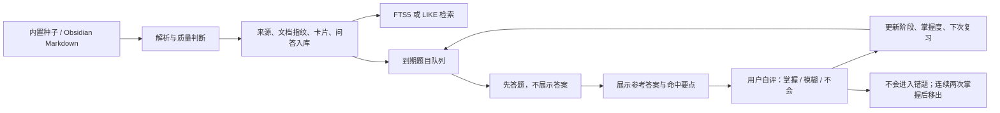
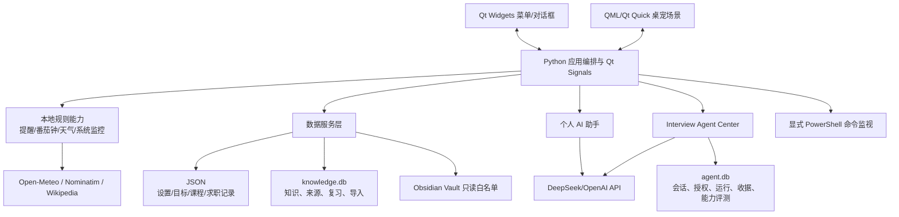
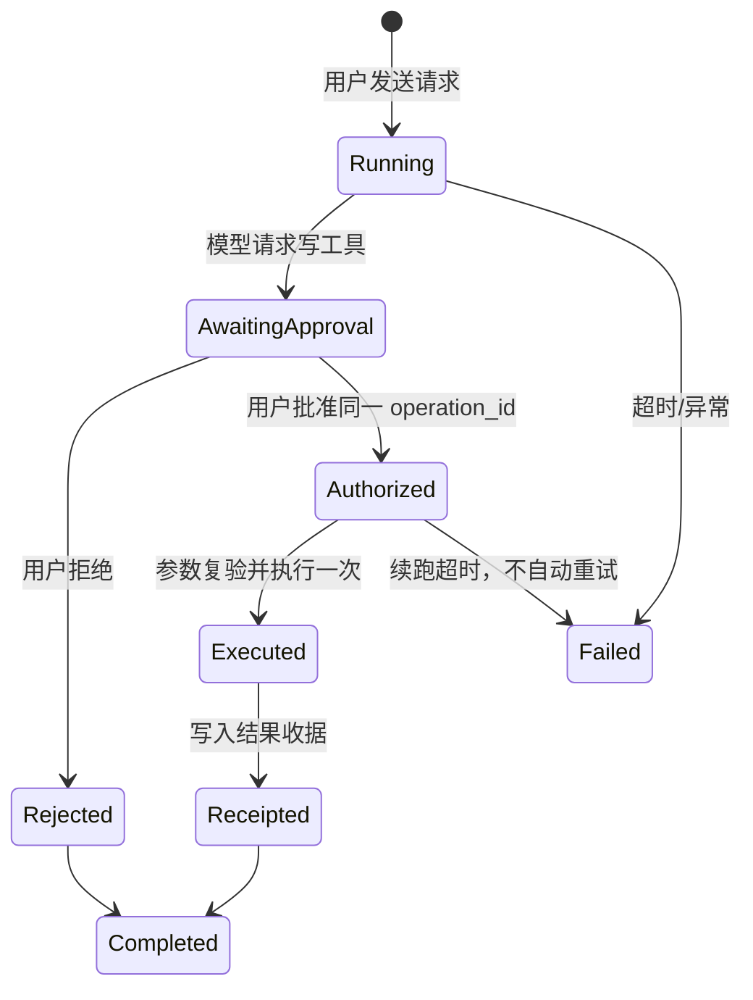

# Table Miku 项目全景、STAR 与面试实战手册

> 基于 `main` 分支 `4cea94c` 的代码快照整理，现场核验日期：2026-08-04。
> 目标：不仅会“介绍项目”，而是能从需求、架构、数据、Agent、安全、测试、故障处理到演进路线，像亲手设计并实现过一样讲清楚。

## 0. 阅读方法与事实边界

这不是只写亮点的简历稿，而是一份“项目心智模型 + 代码导读 + 面试答案 + 生产故障手册”。阅读时始终区分三类事实：

- **已实现**：当前代码中确实存在，可从文末源码索引回查。
- **已验证**：本次在独立临时数据目录中实际运行过测试或检查。
- **建议演进**：生产化方案、竞品类比或下一阶段设计，不能说成当前已完成。

本次没有读取或输出 `.env.local` 中的任何凭据，也没有使用真实用户知识库、课程、投递或面试数据。仓库已有未提交文件均保持不动。

## 1. 一句话定义项目

Table Miku 是一个面向 Windows 单用户场景的本地优先桌面学习与求职助理：用透明置顶桌宠承载提醒、番茄钟、课程表、系统与网络监控，用 SQLite 建立“知识导入—主动回忆—间隔复习—错题回流”闭环，并通过显式数据授权、资源权限、受控工具和逐次写审批接入 AI Agent。

它不是单纯的桌宠，也不是“套壳聊天框”。核心价值是把分散在任务表、笔记、面试题、系统状态和 AI 对话里的信息，收敛成一个长期驻留、低打扰、可追踪的桌面入口。

### 1.1 当前工程规模快照

| 指标 | 当前值 | 如何理解 |
|---|---:|---|
| 生产 Python 文件 | 39 | `table_miku/` 下的模块化单体 |
| 生产 Python 行数 | 12,207 | 仅统计 Git 跟踪的 `table_miku/*.py` |
| 测试文件 | 33 | 单元、存储、UI smoke、Agent 契约等 |
| 测试代码行数 | 3,377 | 测试不是点缀，约为生产 Python 的 28% |
| 测试函数 | 235 | 参数化后本次实际收集 247 个测试项 |
| 当前数据库版本 | 4 | SQLite 迁移按版本顺序执行 |
| 离线 Agent 契约用例 | 18 | 不调用真实模型、不读取真实数据 |
| 当前分支覆盖率 | 53.55% | 项目门槛 40%，但 UI/外部集成仍有明显缺口 |

## 2. 用 STAR 原则讲项目

### 2.1 Situation：为什么要做

准备实习或校招时，常见问题不是“没有工具”，而是工具太散：

- 学习目标在文档里，定时提醒在日历里，知识笔记在 Obsidian 里；
- 刷过的面试题没有形成可重复的复习调度；
- 投递、面试复盘和电脑上的构建任务相互割裂；
- 通用聊天模型不知道本地上下文，知道太多又会带来隐私和误操作风险；
- 桌面助手如果频繁弹窗、卡 UI 或误报，很快就会被关闭。

因此项目选择“桌宠”作为低摩擦入口，但真正要解决的是本地个人工作流的编排、知识记忆闭环和安全 AI 接入。

### 2.2 Task：要达成什么

目标被拆成四个可验收层次：

1. **桌面体验可用**：透明置顶、可拖动、点击互动、托盘与右键菜单、打包后可运行。
2. **本地助理可靠**：学习提醒、番茄钟、天气、系统/网络监控、长命令完成通知不阻塞 UI。
3. **学习数据可积累**：本地知识导入、来源追踪、搜索、主动回忆、间隔复习、错题本和迁移恢复。
4. **AI 能力受控**：外发数据有知情同意，读取有资源授权，写入有逐次审批，多 Agent 只有在真实优于单 Agent 时才启用。

### 2.3 Action：关键动作

#### 阶段 A：从桌宠 MVP 起步

- 使用 PySide6 创建无边框、透明、置顶窗口；
- 使用 QML/Qt Quick 管理精灵、气泡、粒子和交互动效；
- 用 Python 负责业务、持久化、定时器、网络与系统能力；
- 用 PyInstaller 做 Windows 目录式打包。

#### 阶段 B：从功能集合变成个人助理

- 增加目标解析、日程提醒、番茄钟、课程表 PDF、投递和面试复盘；
- 系统监控将 DNS、TCP、TLS、HTTP 分层，避免“网络失败”只有一句模糊提示；
- 长任务用 `QProcess` 和后台线程执行，结果通过 Qt signal 回到主线程。

#### 阶段 C：把知识功能升级为数据系统

- 从 JSON 主存储演进到 SQLite-first，保留旧 JSON 只读迁移；
- 用 schema version、迁移前备份、事务、外键、WAL、FTS5/LIKE 回退保证可演进性；
- 用来源表、文档指纹、问答来源关联、去重关系和导入任务实现可追溯增量同步；
- 用固定间隔和用户自评建立确定性的复习状态机。

#### 阶段 D：把 AI 从“会回答”升级为“可治理”

- 个人助手先做外发数据预览与单次/持续授权；
- Agent Center 将模型限制在本地工具集合中，读取资源按类授权；
- 所有写工具用 Pydantic 校验参数，生成精确预览和 `operation_id`，用户批准后才执行；
- 用 receipt 做幂等，避免超时或重复回调导致二次写入；
- 设计三个只读专家，并用三组合成场景比较单/多 Agent；只有路由全对、多 Agent 均分至少 80 且严格胜出才启用。

#### 阶段 E：把 Vibe Coding 变成工程流程

- 先给 AI 事实包、边界、禁止项、文件路径和验收标准；
- 让 AI 实现小步变更，但由人检查工作区、diff、测试、数据和安全边界；
- 通过 Ruff、分支覆盖、依赖一致性、漏洞审计、离线 Agent eval、Windows 打包 smoke 构成 CI 门禁；
- 保留阶段交接文档，但每次继续前重新读当前代码，避免旧文档覆盖新事实。

### 2.4 Result：结果怎么量化

- 当前 247/247 个测试通过，分支覆盖率 53.55%，超过 40% 门槛；
- 18/18 个离线 Agent 契约评测通过；
- Ruff、`pip check`、生产依赖漏洞审计均通过；
- 本地知识库已经具备版本 4 schema、FTS5 可选降级、增量同步、来源追踪、题目级复习与不可变作答记录；
- Agent 形成“资源授权—工具级复核—写前审批—幂等收据—审计持久化”的完整控制链；
- 当前仍不是生产级云服务：真实 DeepSeek 质量、交互式 Windows 验收、安装包签名、自动更新、加密存储和跨设备同步尚未完成。

### 2.5 三种面试讲法

#### 30 秒版本

> 我做了一个 Windows 本地优先的桌面学习与求职助理。界面用 PySide6 加 QML，知识和复习数据从 JSON 演进到 SQLite，支持 Obsidian 只读增量同步、FTS 搜索、主动回忆和间隔复习。AI 不是直接给系统权限，而是通过资源授权、受控工具、Pydantic 参数、逐次写审批和幂等 receipt 工作。当前有 247 个测试，分支覆盖率 53.55%，CI 还做 Ruff、依赖一致性、漏洞审计和 Windows 打包 smoke。

#### 3 分钟版本

先讲痛点和产品闭环，再讲两条技术主线：

1. **本地数据主线**：`%APPDATA%` 隔离运行数据，SQLite schema v4，迁移前备份，FTS5 失败回退 LIKE；Obsidian 只读白名单同步，用 SHA-256 指纹做增量，用来源关联保证删改时不误删还有其他来源的数据。
2. **Agent 安全主线**：个人助手与 Interview Agent 是两条独立路径。前者强调外发同意，后者强调资源授权和工具治理。模型不能调用 Shell、Web Search 或任意文件；写入必须暂停、展示目标和字段、绑定 operation id，经用户一次性批准后执行并记录 receipt。

最后主动说不足：UI 编排和真实外部 API 覆盖偏低，真实模型评测不进 CI，命令监视器是显式本地高权限功能而不是沙箱，生产化还需要签名、加密和更强可观测性。

#### 10 分钟版本

按本文顺序讲：问题 → 架构图 → 数据闭环 → Agent 控制链 → 测试金字塔 → 一次真实取舍 → 残余风险 → 演进路线。不要逐个菜单念功能，也不要把“用了很多库”当成技术深度。

## 3. 产品功能地图与核心用户旅程

### 3.1 五个能力域

| 能力域 | 已实现能力 | 用户价值 |
|---|---|---|
| 桌宠交互 | 透明置顶、拖动、点击、表情、气泡、托盘、菜单 | 低摩擦、长期驻留 |
| 学习管理 | 目标、计划、课程表、提醒、番茄钟 | 将计划变成可执行动作 |
| 知识复习 | 导入、检索、分层答案、自评、间隔复习、错题本 | 把笔记变成主动回忆闭环 |
| 求职管理 | 投递记录、面试复盘、面试 Agent | 让求职证据和训练上下文连通 |
| 桌面助理 | 天气、CPU/内存/网络、长命令监控、AI 简报 | 降低切换成本，及时发现异常 |

### 3.2 一条完整学习链路



这里最重要的设计是：系统不让模型武断判定“你答对了”。关键点匹配只是确定性提示，最终自评由用户负责。这样牺牲了全自动评分，却避免模型误判直接污染复习状态。

## 4. 总体架构

### 4.1 架构图



### 4.2 为什么是“模块化单体”

这是单用户 Windows 桌面应用，没有多租户、水平扩容和跨服务组织边界。拆微服务会引入部署、认证、网络失败、数据一致性和调试成本。因此保留单进程，但按职责拆模块：UI 编排、存储、知识、监控、AI、Agent 各自独立。

面试回答：

> 我没有为了“架构高级”上微服务。当前边界是单用户、本地数据、单桌面进程，模块化单体的故障域和部署成本最合适。如果未来做多端同步或团队知识库，我会把同步、身份、云端 Agent 执行拆成服务，而本地 UI 和缓存仍保留。

### 4.3 线程与事件模型

- Qt 主线程只做窗口、对话框、菜单和状态更新；
- 网络、知识同步和 Agent 运行放到守护线程或独立 asyncio loop；
- `QProcess` 管理外部 PowerShell，能接收输出、超时、终止和强杀；
- 工作线程通过 Qt signals 把结果送回主线程，避免跨线程直接操作控件；
- 定时器驱动提醒、系统采样、天气与助手调度。

典型风险是：在主线程直接做 HTTP、PDF 解析或大批量 SQLite 操作会冻结桌宠；后台线程若直接改 UI 会触发 Qt 未定义行为。正确模式是“后台计算 + signal 交付不可变结果 + 主线程渲染”。

## 5. 技术栈、选择原因与替代方案

| 技术 | 当前版本/用途 | 为什么选 | 代价与替代 |
|---|---|---|---|
| Python | 3.12+ | 原型快、系统/数据/AI 生态完整 | 启动与打包体积较大；高性能可用 Rust/C++ 扩展 |
| PySide6 | 6.11.1 | Qt 官方 Python 绑定，适合 Windows 桌面和系统托盘 | UI 测试成本高；可替代为 C#/WPF、Tauri、Electron |
| QML/Qt Quick | 精灵、动画、气泡、粒子 | 声明式状态与动画优于手写绘制 | Python/QML 边界调试复杂 |
| Qt Widgets | 菜单、表单、对话框 | 桌面控件成熟，开发效率高 | 风格统一需要额外工作 |
| SQLite | `knowledge.db`、`agent.db` | 零运维、事务、索引、FTS、适合单用户 | 不适合多进程高写并发和远程多租户 |
| JSON | 设置、目标、课程、投递、面试 | 人可读、便于导入导出 | 事务与查询弱，结构演进成本高 |
| FTS5 | 本地全文检索 | 无外部服务、查询快 | 构建环境可能缺 FTS5，因此有 LIKE 回退 |
| pypdf | 6.14.2，课程表 PDF | 纯 Python、集成简单 | PDF 是复杂不可信格式，需要大小/耗时边界 |
| OpenAI Agents SDK | 0.19.2，Agent 编排 | tool、handoff、结构化输出生态 | 兼容提供商能力不一致，必须做 capability test |
| Pydantic | Agent 工具参数/输出 | 强类型、长度和枚举约束、拒绝多余字段 | 不能替代业务权限检查 |
| urllib/ssl/socket | HTTP、DNS/TCP/TLS 探测 | 标准库、少依赖、可分层诊断 | 重试、代理、连接池能力不如 httpx/aiohttp |
| QProcess | 命令监视 | 不阻塞 UI，可取消、拿退出码 | 不是沙箱；命令本身拥有当前用户权限 |
| PyInstaller | 6.20.0 | 面向无 Python 环境的 Windows 用户 | 包体大、误报、签名与更新需另做 |
| pytest/coverage | 9.1.1/7.1.0 | 参数化、临时目录、分支覆盖 | GUI 和真实外部集成仍需手工/专门 E2E |
| Ruff | 0.16.1 | 快速静态检查 | 当前规则集较窄，不等于类型检查或安全扫描 |
| pip-audit | 2.10.1 | 对生产依赖做已知漏洞核对 | 只能发现已公开且可映射的漏洞 |

## 6. 关键实现细节

### 6.1 UI：QML 负责“表现”，Python 负责“事实”

桌宠窗口固定约 320×380，使用透明、无边框、置顶的 tool window。QML 管理角色、键盘、气泡、表达式和动画；Python 通过桥接对象发送内容和状态。

为什么不把业务写在 QML：

- QML 适合状态与动画，不适合迁移、事务、网络诊断和权限策略；
- Python 模块可以直接用 pytest 测试；
- 业务状态只保留一份，减少 QML 与 Python 双向同步造成的漂移。

气泡内容短时直接显示，长内容转详情对话框；展示时长按字符数计算并设上限。这是“环境式 UI”的关键：不抢焦点、不无限遮挡、不把桌宠变成弹窗轰炸器。

### 6.2 运行数据为什么放 `%APPDATA%`

源码/打包资源是只读资产，用户数据放 `%APPDATA%/TableMiku`。测试可以用 `TABLE_MIKU_DATA_DIR` 指到临时目录。

这样解决：

- Program Files 或打包目录可能不可写；
- 升级/替换程序不会覆盖用户数据；
- 测试不会污染真实设置；
- 打包物可检查并排除数据库、日志、缓存和个人记录。

旧版项目 `data/` 运行文件只做一次复制迁移，使用锁和临时替换，旧文件不删除。路径函数拒绝绝对路径和 `..`，防止调用者借相对文件名越出数据根目录。

### 6.3 JSON 的可靠性策略与局限

读取 JSON 时：

- 文件缺失则使用默认值；
- 损坏文件先备份为 `.broken`，再恢复默认结构；
- 数字设置在加载时做上下界夹取，避免负超时、极端采样频率等异常配置。

写入时先写临时文件再 `replace`，降低半写文件概率。当前仍有一个应主动承认的技术债：原子替换失败后会回退为直接写，最终 `OSError` 被吞掉，可能让 UI 以为保存成功。这是可靠性/可观测性问题；生产化应改为：保留原文件、返回明确错误、事件日志记录失败、UI 告知用户并提供重试，不应静默失败。

### 6.4 SQLite schema v4

知识库主要表：

| 表 | 责任 |
|---|---|
| `knowledge_cards` | 知识卡片主体、主题、概览、状态 |
| `knowledge_sources` | 来源类型、链接、可信级别、元数据 |
| `knowledge_chunks` | 可检索文本片段 |
| `review_states` / `review_history` | 卡片级复习状态与历史 |
| `knowledge_qa_pairs` | 结构化题目、答案、关键点 |
| `question_review_states` | 题目级阶段、掌握度、错题状态 |
| `review_attempts` | 每次作答的不可变记录 |
| `knowledge_documents` | Vault 文档路径、hash、mtime、size |
| `knowledge_qa_sources` | 问答与来源的多对多追踪 |
| `ingest_jobs` | 导入任务与幂等标记 |
| `dedupe_links` | 去重/合并关系 |
| `knowledge_fts` | 可选 FTS5 虚表 |

设计原则：

- `PRAGMA foreign_keys=ON` 保证引用完整性；
- WAL 提升读写并行和崩溃恢复体验；
- schema 版本按顺序迁移，迁移前生成 `.bak`；
- DDL 设计为可重复执行，迁移中断后可以安全重试；
- SQL 值使用参数绑定，动态部分只来自程序控制的列/占位符集合；
- FTS5 先探测，缺失时回退 `LIKE`，确保功能降级而不是应用无法启动。

面试追问“为什么 JSON 又保留、SQLite 又增加”：设置类、低关系数据继续用 JSON，复杂知识数据需要事务、索引、多表关联、迁移和全文检索，因此演进到 SQLite；旧 JSON 只读迁移是兼容策略，不是双写。

### 6.5 Obsidian 只读增量同步

同步不是把 Vault 当数据库直接查询，而是构建本地索引：

1. 只扫描 `计算机知识` 和 `05-Interview`；
2. 只接受 `.md` 且 frontmatter 类型为 `knowledge/question/algorithm/interview`；
3. 跳过隐藏/敏感命名，单文件上限 2 MiB；
4. 路径 `resolve` 后必须仍位于允许根目录，防止符号链接越界；
5. 以 parser version + 文件 bytes 的 SHA-256、mtime、size 判断新增/修改/未变；
6. 解析为主题、知识卡、问答和来源关系；
7. 文件删除或变化时，只有对象没有其他来源才归档，避免误删共享内容。

去重不能只比较问题原文。系统把主题和规范化问题组合成 canonical hash；来源通过关联表保留，既防止重复练习，又不丢出处。

### 6.6 来源可信度不是“真相评分”

当前可信排序大致为：官方 100、标准/RFC 95、论文 90、Obsidian 只读笔记 85、Wikipedia 55、离线种子 40。它用于排序、选择与展示来源，不代表内容已经自动事实核验。

尤其要说清：官方文档条目目前主要保存链接和元数据，不代表程序下载并解析了全部官方正文；Wikipedia 更新是手动触发，最多 4 并发、单请求 12 秒、整批 30 秒，可部分成功，而且只补缺失内容，不覆盖本地高质量概览。

### 6.7 间隔复习状态机

间隔数组为：`1 小时 → 1 天 → 3 天 → 7 天 → 14 天 → 30 天`。

| 自评 | 阶段 | 掌握度 | 错题行为 | 下次复习 |
|---|---|---|---|---|
| 掌握 `known` | +1，最高 5 | +0.20，夹到 1 | 连续两次掌握后移出错题 | 新阶段对应间隔 |
| 模糊 `fuzzy` | 不变 | +0.05 | 保持当前状态 | 1 天 |
| 不会 `forgotten` | 回 0 | -0.15，最低 0 | 进入错题，错误次数 +1 | 1 小时 |

优点是确定、可解释、易测试；缺点是没有像 FSRS 那样根据历史记忆概率自适应。生产演进可以保留事件日志与不可变 attempts，在此基础上离线估计难度和稳定性，再灰度替换调度器。

### 6.8 系统与网络监控

CPU/内存不是一次超阈值就提示，而是连续多次异常后告警，恢复后也通知；这是迟滞思想，用来降低抖动误报。网络探测拆成 DNS、TCP、TLS、HTTP 和延迟，能区分域名解析、端口、证书/代理、HTTP 状态等故障。

风险控制：

- 每个网络操作有超时；
- 自动检测连续异常才告警，手动检测立即返回；
- 后台运行，避免 UI 阻塞；
- 日志只保留必要诊断元数据。

### 6.9 PowerShell 命令监视器

它通过 `powershell.exe -NoProfile -NonInteractive -Command` 执行用户明确输入的命令，不启用 `ExecutionPolicy Bypass`。默认超时 600 秒，可取消；先 terminate，3 秒后仍未退出再 kill；UI 只展示末尾约 420 字符，事件日志不记录完整命令和输出。

必须准确表述安全边界：**这不是沙箱，也没有命令 allowlist 或工作目录约束**。它拥有当前用户的系统权限，安全性来自“只接受本地用户显式操作、没有 Agent 工具入口、可取消、有限日志”，而不是来自命令本身被隔离。若未来允许模型或远程任务触发，必须改成固定任务定义、参数数组、受限工作目录、最小权限子进程和更强审计。

## 7. 两条 AI 路径必须分清

### 7.1 个人助手

用途是生成简短提醒/简报。它可以调用 DeepSeek Chat Completions、OpenAI Agents SDK，SDK 不可用时回退 OpenAI Responses API。上下文是经过裁剪的任务、系统状态、最近事件、求职/课程信息和少量知识卡。

控制点：

- 默认本地模板可工作；
- 云调用前弹出数据范围、接收方、模型和 endpoint；
- 用户选择仅一次或持续授权，持续授权可撤销；
- API key 从环境变量或本地 env 文件读取，不写事件日志；
- 日志对 key/token/password/auth、Bearer、`sk-`/`sess-` 等模式脱敏并轮转；
- 低层 HTTP 对 SSL/OSError 最多重试 2 次，HTTP 错误不自动重试。

### 7.2 Interview Agent Center

用途是可持续会话、检索本地知识、分析复习、生成学习计划并在审批后写入。它只使用 `DEEPSEEK_API_KEY` 和配置的 `base_url/model`，SDK tracing 与敏感 trace 关闭。

#### 资源授权

| 资源 | 默认 | 可能读取的内容 | 双层防线 |
|---|---|---|---|
| 知识库 | 允许 | 检索卡片与来源 | 提交前意图门 + 工具内 grant |
| 复习与错题 | 允许 | 到期题、错题、历史 | 隐藏答案、限制条数、裁剪字段 |
| 学习目标 | 不允许 | 目标与计划 | 显式勾选后才可读 |
| 课程表 | 不允许 | 课程时间 | 显式勾选后才可读 |
| 投递/面试 | 不允许 | 公司、岗位、复盘摘要 | 显式勾选 + 文本脱敏/裁剪 |

单次工具最多 8 条、序列化结果最多 12,000 字符。限制既控制 token/cost，也降低一次性泄露面。

#### 工具体系

只读工具包括知识检索、到期复习、错题、作答历史、目标、课程表、投递/面试记录。写工具包括：

- 标记知识已学；
- 记录复习答案；
- 应用学习计划；
- 同步本地知识库。

没有 Shell、PowerShell、任意文件系统、原始 Vault 或 Web Search 工具。

#### 写审批状态机



关键不变量：

- 参数由 Pydantic 限长度、范围、枚举和列表数量；
- 预览展示准确目标、字段和不可逆标记；当前四类写均标为 `reversible=false`；
- 批准的 `operation_id` 必须与挂起操作完全一致；
- receipt 以 `operation_id` 为主键，相同 ID 只返回既有结果；
- 一次批准只覆盖一次写，不覆盖后续新写；
- 记录答案时，服务端根据数据库中的真实题目重新算关键点，不信任模型提交的 `matched_points`；
- 超时或中断不自动重试，避免重复成本和重复副作用。

这本质上是在做 Agent 的 confused-deputy 防御：模型可以提出动作，但不能把“它认为用户想做”当成用户授权。

### 7.3 单 Agent 与多 Agent

多 Agent 不是角色名越多越好。当前设计中只有 Interview Coach 输出最终用户响应，三个专家作为只读工具：

- Knowledge Tutor：知识解释与来源；
- Practice Analyst：作答与薄弱点分析；
- Review Planner：复习计划。

启用前先做一次 capability test：用不含用户数据的合成请求验证 chat、forced function tool 和 JSON 参数约束。随后运行三组合成场景（Spring IoC、MySQL 最左前缀、Redis/MySQL 复习规划），并行比较单 Agent 和多 Agent，最多 12 次模型响应。

评分由内容覆盖 90 分和路由 10 分组成；必须三个场景都选对专家、多 Agent 平均分至少 80，且严格高于单 Agent。结果按 `base_url + model` 缓存在 `agent.db`。如果失败、超时或没有胜出，就保留单 Agent，不为架构炫技买额外延迟和 token。

### 7.4 Agent 持久化

`agent.db` 保存 sessions、messages、runs、receipts、capabilities、topology evaluations、resource grants。每会话最多保留 100 条消息，会话默认 90 天清理；启动时将中断运行标记为取消。运行只取最近 20 条历史进入上下文，主执行最多 8 turns、SDK client 不自动重试、单次总体上限 90 秒。

## 8. 数据怎样测、Agent 怎样测

### 8.1 测试分层

| 层 | 代表测试 | 主要证明什么 | 不能证明什么 |
|---|---|---|---|
| 纯函数单元 | goal parser、encoding、review scheduler、pomodoro | 边界、格式、状态转移确定 | 真实 UI/网络 |
| 持久化 | knowledge db/repository/migration | schema、事务、迁移、查询、回退 | 长期真实数据规模 |
| 数据管道 | sync、seed、sources、dedupe、QA | 增量、删除、来源、去重、解析 | 所有真实 Markdown 写法 |
| 服务 | knowledge service/base | 聚合、局部失败、超时语义 | 真实公网稳定性 |
| UI smoke | import/QML/learning UI | 模块可导入、offscreen 启动、关键交互 | Windows 实机视觉和托盘行为 |
| Agent 核心 | agent core/center/consent | grants、审批、receipt、超时、能力门 | 真实模型答案质量 |
| Agent eval | 18 个合成契约 | 禁止工具、路由结构、审批要求 | 延迟、token、线上 tool choice |
| CI 打包 | PyInstaller smoke | 能生成 `TableMiku.exe` | 安装、签名、杀软兼容和长期运行 |

### 8.2 数据测试的关键场景

1. **隔离**：所有测试把 `TABLE_MIKU_DATA_DIR` 指向临时目录，不接触 `%APPDATA%`。
2. **迁移**：从旧 schema 或旧 JSON 启动，验证版本顺序、备份、幂等和数据保留。
3. **FTS 降级**：模拟 FTS5 不可用，搜索回退 LIKE；尤其验证中文没有 token 命中时仍能返回合理结果。
4. **增量**：同一文档未变不重复写；修改只更新相关对象；删除不误伤仍有其他来源的题目。
5. **去重**：空白、大小写、标点、主题差异形成稳定 canonical identity。
6. **复习**：固定 `now` 验证每种自评的阶段、掌握度、下次时间、连续掌握和错题退出。
7. **不可变记录**：每次作答新增 attempt，不覆盖历史；状态是可变投影，attempt 是审计事实。
8. **失败语义**：查询可降级为空列表，写入失败必须抛 `KnowledgeStorageError`，避免 SQLite 失败后偷偷写 JSON 形成 split brain。
9. **批量查询**：批量加载卡片详情，避免 UI 列表产生 N+1。

### 8.3 Agent 测试的四个维度

#### 权限测试

- 未授权资源在模型运行前就被识别并阻止；
- 即使绕过前置意图判断，工具本身仍检查 grant；
- 到期题/错题工具不泄露参考答案。

#### 写安全测试

- 没有批准返回 `approval_missing`；
- 错误 operation id 不能消费另一项批准；
- 拒绝后数据库不变；
- 重复 operation id 返回既有 receipt，不重复写；
- 模型伪造关键点时，后端按存储题目重算。

#### 拓扑与能力测试

- 不支持 function tools 或结构化 JSON 的提供商不能开启 Agent；
- 专家路由不全对、多 Agent 不到 80 或没有严格胜出时，回退单 Agent；
- 合成评测不读用户库、不读 key、不碰生产 DB。

#### 真实模型评测

不能放进普通 CI，因为有费用、网络波动、模型漂移和隐私风险。正确做法是手动、合成数据、固定 rubric、记录模型和 endpoint，并把“能力可用”和“答案质量足够”分开评估。

### 8.4 本次现场验证结果

| 检查 | 结果 |
|---|---|
| Ruff | `All checks passed` |
| Pytest | 247/247 passed，26.76 秒 |
| 分支覆盖率 | 53.55%，门槛 40% |
| `pip check` | 无损坏依赖 |
| `pip-audit -r requirements.txt` | 未发现已知漏洞 |
| 离线 Agent eval | 18/18 passed，明确未调用真实 DeepSeek |

覆盖率要诚实解释：知识 DB 约 92%、repository 约 83%、sync 约 83%，但 `app.py` 约 21%、个人助手/数据聚合约 10%～13%、天气约 35%。所以“测试全绿”说明确定性核心较稳，不代表 GUI、系统集成或云 API 已充分覆盖。

Ruff 当前也只是一个基础门禁：目标 Python 3.12、行宽 120，检查 `E4/E7/E9/F`，并暂时忽略部分兼容性遗留的未使用 import/变量等规则。面试时不能把它说成完整类型检查或 SAST；后续可逐步收紧规则并增加类型检查。

本次没有重新执行 PyInstaller 打包、Windows 可见 UI/托盘验收，也没有调用真实 DeepSeek；这些属于未验证项。

## 9. 安全设计、已解决问题与残余风险

### 9.1 威胁模型

| 资产 | 低信任输入 | 主要威胁 | 现有控制 |
|---|---|---|---|
| API key | env、本地 env 文件、provider 错误 | 泄漏到日志/包/错误 | 不打印 key、日志脱敏、打包清单排除运行数据 |
| 学习/求职数据 | 用户输入、模型请求 | 未经同意外发 | 单次/持续 consent、资源 grants、上下文裁剪 |
| 本地文件 | Markdown/PDF/路径 | 路径越界、解析 DoS、误写 Vault | 白名单、resolve containment、2 MiB 上限、只读 |
| 数据库完整性 | 导入、迁移、Agent 写 | 重复写、半迁移、split brain | 事务、版本迁移、备份、幂等 receipt、写失败抛错 |
| 系统权限 | 命令输入、模型输出 | 命令执行、confused deputy | 命令仅显式本地入口；Agent 无 Shell，写逐次批准 |
| 构建产物 | pip 包、GitHub Actions、素材 | 供应链、秘密打包、版权 | 精确依赖版本、pip-audit、只读 CI 权限、资产许可分离 |

### 9.2 已实现的安全控制链

1. **最小外发**：默认本地能力；云调用前展示发送范围，持续授权可撤销。
2. **最小读取**：Agent 资源分组授权，默认只开知识和复习；工具再次校验。
3. **最小工具**：没有 Shell、任意文件、原始 Vault 和 Web Search。
4. **结构化参数**：Pydantic 限制类型、长度、数量和枚举，但业务层仍复验真实对象。
5. **人类在环**：所有写操作暂停并展示目标/字段，一次授权只覆盖一个 operation id。
6. **幂等与审计**：receipt 防重复副作用，会话/运行/授权状态进 SQLite。
7. **路径安全**：运行路径拒绝绝对和 `..`；Vault 还做解析后包含检查与符号链接防护。
8. **注入防护**：SQL 值参数化；FTS 查询字符规范化并引用 token；命令不由 Agent 拼接。
9. **秘密保护**：日志按字段和模式脱敏、限制大小、轮转；命令全文和输出不落日志。
10. **供应链门禁**：依赖精确固定、`pip check`、`pip-audit`、CI 最小 `contents: read`。

### 9.3 Prompt Injection 怎么看

Obsidian 笔记和模型回复都应视为不可信数据。当前最重要的缓解不是一句“忽略恶意提示词”，而是能力隔离：

- 笔记只能作为检索内容，不会直接执行；
- Agent 没有 Shell、任意网络和任意文件；
- 读取超出资源授权会在两层被拒绝；
- 写入必须有人批准且绑定精确参数；
- 结果有条数和字符上限。

残余风险是：恶意笔记仍可能影响模型措辞，诱导它调用用户已经授权的其他读取工具，或在最终回答中混淆事实。后续可增加内容/指令分隔、来源引用强制、工具调用策略检查、敏感字段分类和红队 eval，但不能把 prompt 文本防御当成唯一安全边界。

### 9.4 必须主动承认的残余风险

| 风险 | 当前状态 | 建议处理 |
|---|---|---|
| PowerShell 非沙箱 | 只允许本地用户显式触发，Agent 无入口 | 若接远程/AI，改固定任务、参数数组、受限 cwd 和最小权限 |
| 用户数据明文 | 位于当前用户 `%APPDATA%` | 敏感字段用 DPAPI/系统凭据库，数据库可选加密 |
| JSON 最终写失败静默 | 可能出现“看似保存成功” | 失败显式返回、日志、UI 重试与原文件保留 |
| API `base_url` 可配置 | 受本地设置控制，key 会发给配置端点 | UI 显示 host、默认 HTTPS、变更二次确认，可选域名 allowlist |
| PDF/图片解析面 | 本地选择或固定远程来源 | 加大小/页数/像素/耗时限制，隔离解析，及时更新依赖 |
| GitHub Actions 用 major tag | 官方 action，但不是 commit SHA | 高保证发布链改为 SHA 固定并使用 Dependabot 更新 |
| 安装包未签名/无自动更新 | 当前偏源码/目录包分发 | 代码签名、hash 发布、更新清单签名、回滚 |
| GUI/外部集成覆盖低 | 核心数据覆盖高，UI 约 21% | pytest-qt、真实 Windows E2E、mock server、故障注入 |
| 日志仍含业务摘要 | 已脱敏和轮转，但非加密 | 数据分级、默认更少、用户可清理、敏感模式测试 |
| 多 Agent 成本与漂移 | 有质量门和缓存，不自动重试 | 记录 token/延迟，按模型版本失效缓存，设预算上限 |

### 9.5 安全审计边界

本次依赖漏洞审计通过；同时完成了源码级威胁模型和关键边界检查。Codex Security 标准扫描尝试生成全仓 109 文件清单时，被任务开始前就存在且当前进程无权访问的多个 `.tmp_pytest*` 目录阻断。为保护用户原有文件，没有移动、删除、改 ACL 或改忽略规则。因此不能把本节表述为“一次完整标准安全扫描无发现”；正确说法是“关键安全路径经人工证据审计，自动全仓覆盖未闭合”。

## 10. Vibe Coding：怎样用 AI 写代码而不失去工程控制

### 10.1 仓库中能证明什么

仓库存在面向 Claude Desktop/Cline/Aider 的任务说明、实现规格、阶段交接和开发计划；Git 历史也呈现从 MVP、助理、知识 SQLite、同意机制、硬化到 Agent Center 的小步演进。这能证明项目采用了 AI 友好的规格化协作流程，但不能仅凭这些文件断言某一行代码由哪个模型生成。

### 10.2 推荐工作流


一个高质量任务包至少包含：

- 当前事实：分支、模块、已有行为、失败证据；
- 明确范围：允许改哪些文件、哪些接口；
- 禁止项：不改数据格式、不联网、不加依赖、不碰用户文件等；
- 验收：修复前失败、修复后通过的测试和手工步骤；
- 失败策略：无法复现时停止猜改，报告证据缺口；
- 交付：diff、测试、风险、是否提交/推送。

### 10.3 Vibe Coding 最容易踩的坑

| 坑 | 本项目中的对应风险 | 解决方式 |
|---|---|---|
| 一次提示做完整产品 | UI、存储、Agent 同时变化，无法定位回归 | 按逻辑单元小步实现与验证 |
| 旧文档被当成当前事实 | 旧总结仍描述 JSON 主存储，当前已 SQLite-first | 每次先读当前代码、测试和 Git 状态 |
| 生成代码“看起来能跑” | GUI、线程、迁移、幂等很容易隐藏错误 | 建失败测试、跑全量、人工审调用链 |
| 模型擅自扩大范围 | 顺手重构、升级依赖、改公开接口 | 任务包写明精确文件和禁止项 |
| 为绿灯弱化测试 | 删除断言或吞异常 | 先解释失败，再修生产根因 |
| 把模型当安全边界 | prompt 说“不要写”并不可靠 | 工具、权限、审批、receipt 在代码层强制 |
| 自动提交/发布 | 把未验证代码带入主分支 | 人确认暂存 diff，CI 绿不等于授权发布 |

### 10.4 面试官问“你是不是全靠 AI 写的”

可回答：

> 我把 AI 当实现和审查加速器，不把它当需求负责人或安全边界。我的工作是定义问题、拆边界、设计数据模型和不变量、要求回归测试、审 diff、做真实验证并承担最终取舍。比如 Agent 写操作不是 prompt 里说“请先询问”，而是运行时暂停、operation id、Pydantic 校验、用户审批和幂等 receipt；这类设计必须由工程约束保证。AI 提高了编码吞吐，但项目所有权仍在我。

## 11. 实际开发常见情况与处理手册

| 场景 | 先看什么 | 处理方案 | 原因 |
|---|---|---|---|
| 启动即崩 | traceback、Qt plugin、依赖、数据目录 | 用临时数据目录复现，先 import smoke，再 QML offscreen | 区分代码、Qt 环境和用户数据 |
| UI 卡死 | 是否在主线程 HTTP/PDF/DB | 后台线程执行，signal 回主线程 | Qt event loop 不能被阻塞 |
| 设置没保存 | 文件权限、临时 replace、日志 | 让写函数返回失败并在 UI 告知，保留原文件 | 静默吞错会制造假成功 |
| SQLite locked | 长事务、连接未关、并发写 | 缩短事务、统一 repository、timeout/WAL、确保关闭 | SQLite 适合短事务，不适合多写者长期占锁 |
| 升级后数据丢失 | schema version、备份、迁移日志 | 只在事务内迁移，失败回滚，保留 `.bak`，做旧版本夹具 | 数据迁移必须可重放、可恢复 |
| FTS 无结果 | FTS5 是否存在、中文 token | 验证探测与 LIKE fallback，不把空结果当无数据 | 部分 Python SQLite 构建不含 FTS5 |
| Obsidian 重复题 | canonical hash、topic、来源关系 | 规范化问题并按来源 upsert，不按文件名盲插 | 文件移动/多来源会制造重复 |
| Vault 文件删除后题目消失 | QA 是否还有其他来源 | 只在 orphan 时归档 | 来源是多对多，不能级联误删 |
| 符号链接越界 | `resolve` 后路径、根目录包含关系 | 先解析再包含检查，失败跳过并记录 | 字符串前缀不能防 symlink traversal |
| PDF 导入异常 | 页数、文本层、编码、布局 | 限制输入，保留原文片段，解析失败给出可行动提示 | PDF 可能是扫描图或布局流错乱 |
| 天气城市错误 | auto/IP、VPN、地理编码候选 | 推荐区县+市+省或经纬度，并显示置信度 | IP 定位不是精确位置 |
| 网络误报 | DNS/TCP/TLS/HTTP 哪层失败 | 连续失败才自动告警，手动探测显示分层 | 一次超时不等于持续故障 |
| API 401/403 | key、模型权限、endpoint | 返回分类错误，不打印 key | 认证、授权、模型不存在含义不同 |
| API 429 | 额度还是速率 | 区分 quota/credit 与 rate limit，人工决定何时重试 | 自动重试会增加费用和雪崩 |
| SSL/DNS 超时 | 系统时间、代理、VPN、防火墙 | 给友好提示和有限重试，保持本地功能可用 | 外部失败不能拖垮桌面主流程 |
| Agent 读了不该读的数据 | grant 状态、工具日志、前置意图 | 前置阻断 + 工具级 fail closed + 回归测试 | 单层 prompt 约束可被绕过 |
| Agent 重复写 | operation id、receipt、超时点 | 相同 id 返回 receipt，超时不自动续写 | exactly-once 很难，至少做到幂等副作用 |
| Agent 评分幻觉 | 模型参数与数据库题目 | 后端重算命中点，用户自评决定状态 | 不信任模型提交的派生事实 |
| 多 Agent 更慢更差 | 路由、得分、token、延迟 | 质量门不通过就单 Agent，缓存按 endpoint+model | 多角色不是免费收益 |
| 命令长时间不退出 | QProcess 状态、子进程树、输出 | 超时/取消，terminate 后 kill，展示尾部输出 | UI 必须可恢复，日志不能无限增长 |
| CI 绿但本机失败 | offscreen 与真实 Windows 差异 | 按维护清单做托盘、拖动、气泡、授权、取消的实机验收 | headless smoke 不覆盖窗口管理器行为 |
| 打包成功但用户打不开 | DLL/plugin、路径、杀软、签名 | 在干净 Windows VM 测试，检查 PyInstaller 收集项与签名 | 开发机成功不代表分发环境成功 |
| 怀疑秘密进入 Git | staged diff、历史、产物 | 停止提交，撤销暂存但保留工作，轮换已泄露 key | 删除文件不能撤回已泄露凭据 |
| 测试偶发失败 | 时间、网络、共享目录、顺序依赖 | 固定时钟、mock 网络、临时数据目录、随机顺序复跑 | flaky test 会让门禁失去可信度 |
| 线上模型行为漂移 | model/base_url、能力缓存、质量分 | 模型变更使缓存失效，重新 capability/quality eval | “同名模型”也可能后端升级 |

## 12. 高频面试问题与参考回答

### Q1：项目最难的部分是什么？

> 不是画桌宠，而是把本地数据、外部 AI 和系统权限放进同一个桌面进程后，仍然保持可控。最难的是定义边界：哪些数据能出本机、Agent 能读什么、写操作如何暂停并准确批准、超时如何避免重复副作用。我用 consent、resource grant、tool-level check、operation id、receipt 和 no-auto-retry 把这条链做成代码约束。

### Q2：为什么用 PySide6，不用 Electron？

> 项目需要透明置顶窗口、托盘、QProcess、Windows 启动项和较轻的本地常驻体验，Qt 对桌面系统能力成熟；Python 又方便做 SQLite、解析和 AI。Electron 的 Web 生态更强，但运行体积和资源占用更高。当前团队/项目规模下 PySide6 性价比更好。

### Q3：为什么同时用 Widgets 和 QML？

> QML 擅长声明式动画和状态，Widgets 擅长复杂表单、菜单和传统对话框。混合能让桌宠表现层灵活，同时让业务 UI 快速稳定。代价是桥接复杂，所以我把事实状态放 Python，QML 只消费信号。

### Q4：为什么从 JSON 迁到 SQLite？

> JSON 适合小型设置，但知识系统出现多来源、多对多、历史、全文搜索、迁移和事务后，继续用 JSON 会产生全文件重写、并发、索引和一致性问题。SQLite 零运维又能提供事务、索引、FTS 和 schema 迁移，符合单用户桌面边界。

### Q5：如何保证迁移安全？

> 先识别当前版本，迁移前备份，按版本顺序在事务里执行，DDL 尽量幂等，成功后更新版本。旧 JSON 只读迁移并写 ingest marker，避免反复导入。测试从旧夹具升级并重复执行，验证数据数量、关联和版本。

### Q6：为什么用 WAL？

> 桌面应用常见“UI 读、后台同步写”。WAL 允许读者和写者更好并行，也有崩溃恢复优势。但它不是无限并发方案，所以事务要短、连接要及时关闭、写入口仍集中在 repository。

### Q7：FTS5 不可用怎么办？

> 启动时先做 probe；可用则建虚表并维护索引，不可用则回退参数化 LIKE。功能可以变慢，但不能因为一个 SQLite 编译选项让应用无法启动。测试同时覆盖两条路径。

### Q8：复习算法科学吗？

> 当前是可解释的固定间隔状态机，不宣称达到 Anki FSRS 的成熟度。它使用主动回忆、自评和递增间隔的基本原则，优点是确定、易测、适合 MVP；后续可基于不可变 attempt 数据拟合更个性化的记忆模型。

### Q9：为什么不让 AI 自动判题？

> 开放题自动评分容易受措辞、知识版本和模型漂移影响。当前只用确定性关键点覆盖做提示，参考答案在提交后展示，最终自评由用户决定。这样把模型建议和状态变更解耦，避免错误标签污染长期复习。

### Q10：怎样防 prompt injection？

> 不把 prompt 当安全边界。外部/笔记内容进入模型后，模型仍只能使用固定工具；读要过 resource grant，写要逐次审批，参数和真实对象在服务端复验，没有 Shell/Web/任意文件。文本隔离和红队提示可以增强，但能力最小化才是根控制。

### Q11：为什么每个写操作都要批准，会不会体验差？

> 这是风险分级。知识搜索等只读低风险操作无需逐次确认；修改复习、计划或同步状态有长期副作用，所以展示准确目标和字段再批准。未来可以对可撤销、低风险、重复动作提供有范围和期限的 standing policy，但当前四种写都不可逆标记，宁可保守。

### Q12：幂等 receipt 解决什么？

> 网络/模型超时会产生不确定状态：客户端不知道服务端是否已经写成功。如果直接重试，可能重复记录答案或重复应用计划。以 operation id 做唯一键，已完成就返回既有结果，至少让副作用达到幂等；同时禁用自动 retry，避免新的不确定执行。

### Q13：多 Agent 为什么可能更差？

> 多一次路由就多一次错误、延迟和 token；专家之间还可能丢上下文。只有任务确实可分解、专家工具边界清晰，而且合成场景实测胜出时才值得用。所以项目把多 Agent 当待验证优化，不当默认信仰。

### Q14：单/多 Agent 评测可靠吗？

> 它是三组合成场景的工程门，不是通用学术 benchmark。能证明当前 endpoint/model 在这些任务上路由正确、覆盖 rubric 且胜过基线；不能证明所有真实问题都更好。生产还要记录真实用户反馈、延迟、token、失败率，并定期重评。

### Q15：单元测试和 eval 有什么区别？

> 单元测试验证确定性代码契约，例如 grant、迁移和 receipt；eval 验证非确定模型在 rubric、路由和内容覆盖上的表现。前者应进 CI 且稳定，后者要控制数据、费用和漂移，真实 API 通常手动或定时运行。

### Q16：53.55% 覆盖率算高吗？

> 不能只看总数。数据核心在 80%～90% 左右，UI 编排和外部集成明显更低。这个分布说明高风险确定性逻辑已有较好保护，但真实桌面和云端路径还需 E2E。我会优先补审批续跑、命令取消、迁移失败、UI 线程和 mock provider，而不是为了数字测试 getter。

### Q17：为什么用分支覆盖？

> 语句执行一次不代表异常、fallback、拒绝和超时分支被验证。这个项目大量逻辑是“FTS 有/无、批准/拒绝、known/fuzzy/forgotten、DNS/TLS/HTTP 错误”，分支覆盖比纯行覆盖更贴近风险。

### Q18：如何避免 flaky test？

> 固定时间、临时数据目录、mock 外部网络/模型、offscreen Qt、不要依赖执行顺序；并把真实 API 测试从普通 CI 分离。出现偶发失败先定位共享状态和时间边界，不能简单重跑到绿。

### Q19：安全做得最好的点是什么？

> Agent 写链路是最完整的：模型没有通用系统工具，资源读是 fail-closed，写参数结构化，预览绑定 operation id，用户逐次授权，服务端复验，receipt 幂等，超时不自动重试。它把人类在环落实成状态机，而不是一句 prompt。

### Q20：最大的安全技术债是什么？

> 本地 PowerShell 是当前用户权限下的任意命令，它适合显式本地工具但不是沙箱；另外数据明文、安装包未签名、可配置 endpoint 和 GUI/解析器覆盖不足都需要生产化加强。我会根据是否引入远程/AI 触发来决定命令执行是否必须重构。

### Q21：怎么处理错误与降级？

> 先区分可降级读取和不可吞写入：搜索失败可以暂时返回空并提示，写入失败必须抛错避免 split brain。外部网络失败不影响本地能力；FTS 缺失回退 LIKE；多 Agent 不达标回退单 Agent。降级要保持数据正确性，不能只追求“应用不崩”。

### Q22：如何处理并发？

> UI 主线程只渲染；后台任务通过 signal 回传；SQLite 使用短事务、WAL 和独立连接；Agent 一次只允许一个 active run；审批期间保存 pending 状态。当前没有多进程高写并发，如果未来云同步则需要版本号、冲突策略和队列。

### Q23：如何做可观测性又不泄密？

> 记录发生了什么、何时、状态和审计 id，但对 key/token/password/auth 和 secret 模式脱敏；命令正文与完整输出不入日志；日志有大小和备份上限。生产会进一步加 event type、duration、failure class、correlation id，同时对业务字段做数据分级。

### Q24：打包发布要注意什么？

> CI 能生成 exe 只是第一关。还要在干净 Windows 测 Qt plugins、托盘、路径、开机启动、杀软；检查包内没有 `.env`、数据库、日志、缓存和用户记录；确认素材许可；生成 hash、代码签名和可回滚版本。当前项目没有自动发布权限链，CI 绿不等于发布授权。

### Q25：如果数据量扩大 100 倍？

> 先测真实瓶颈：索引、批量加载、FTS、同步解析和 UI 分页。优化顺序是查询计划与索引、批量 API、增量事务、后台分页，再考虑分库或云服务。单用户 SQLite 处理几十万级结构化记录通常仍可行，不能先入为主换数据库。

### Q26：如果做多端同步？

> 本地仍保留离线 SQLite，把不可变 attempts 和文档变更作为同步事件；服务端提供身份、设备、版本向量/游标和冲突策略。设置可 LWW，复习 attempt 适合 append-only 合并，卡片编辑需要字段级冲突；API key 不直接同步，使用各平台安全存储。

### Q27：如果做团队版？

> 必须新增身份、租户、RBAC、服务端数据库、审计、数据保留与删除、共享知识权限。现有 resource grant 是单用户对 Agent 的授权，不能冒充多租户授权模型。桌面 SQLite 变缓存，服务端才是权威源。

### Q28：你做过什么失败取舍？

> 早期 JSON 适合快速验证，但知识来源、复习历史和搜索增长后复杂度失控，所以迁到 SQLite；同时保留只读迁移而不是一次性破坏兼容。另一个取舍是多 Agent 默认关闭，只有实测胜出才开，避免为了概念牺牲成本与稳定性。

### Q29：如果让你继续一个月，优先做什么？

> 第一优先补可靠性和安全闭环：修 JSON 静默写失败、增加真实 Windows E2E、签名/打包清单验证、provider mock 集成测试；第二优先做可观测性和真实 Agent 指标；第三才是语音、更多动画或跨端等新功能。

### Q30：你在项目中的个人贡献怎么说？

只说能被代码、提交或测试证明的内容。可用句式：

> 我负责把需求拆成可验收阶段，设计本地数据与 Agent 权限边界，推动从 JSON 到 SQLite 的演进，补齐迁移/同步/复习/审批测试，并建立 CI 门禁。AI 工具参与了实现和审查加速，但架构取舍、验收和最终责任由我承担。

## 13. 与市面产品和大厂业务的相似处

这些是“问题和机制相似”，不是规模、成熟度或商业能力等同。

| 参照产品/业务 | 相似点 | Table Miku 的差异 |
|---|---|---|
| [Desktop Mate](https://www.infiniteloop.co.jp/desktopmate/) | 桌面角色、窗口/鼠标互动、闹钟和低打扰常驻 | Table Miku 是 2D/QML、本地开源工程，重点是学习/求职数据与 Agent；3D、IP 内容和商业平台成熟度不在同一层级 |
| [Anki](https://docs.ankiweb.net/background.html) | 主动回忆、按反馈拉开复习间隔 | Table Miku 是固定六阶段和自评，未达到 Anki/FSRS 的算法、跨端与插件成熟度 |
| [Obsidian](https://obsidian.md/help/Files%2Band%2Bfolders/How%2BObsidian%2Bstores%2Bdata) | 本地 Markdown Vault、元数据索引 | Table Miku 不做编辑器，只读白名单导入后转成结构化练习数据 |
| [Microsoft Viva Insights Focus plan](https://support.microsoft.com/en-us/viva/insights/focus-plan-for-viva-insights) | 专注时间、提醒、工作节奏 | Table Miku 是本地番茄钟和学习提醒，没有企业日历、Teams 与组织洞察 |
| [Google Tasks](https://support.google.com/tasks/answer/7675772?hl=en) | 任务、截止时间、通知、跨工作流入口 | Table Miku 更强调本地桌宠入口和学习闭环，目前没有云同步与 Workspace 集成 |
| [GitHub coding agents](https://docs.github.com/en/copilot/concepts/agents/about-third-party-coding-agents) | prompt/issue → agent 工作 → 人审 → 迭代；生成代码还需安全验证 | 本项目的 Vibe Coding 是本地规格、测试和 diff 审核流程，没有自动创建 PR 或云端任务编排 |

可进一步类比的大厂工程机制：

- **Google/微软的任务与专注业务**：提醒不是简单定时器，而是偏好、免打扰、进度和跨上下文入口；
- **搜索/推荐系统**：知识来源排序、可信度、去重和检索是一个缩小版内容管道；
- **支付/订单系统**：Agent `operation_id + receipt` 与支付幂等键思想相同，重点是副作用不能因重试重复；
- **权限平台**：resource grant 类似 scope/capability，而不是“登录后全能”；
- **CI/CD 平台**：代码、测试、依赖审计、打包是分层门禁，绿灯只证明门禁通过，不自动代表业务批准发布。

## 14. 这些技术在其他项目怎样复用

| 技术思想 | 可复用场景 |
|---|---|
| `%APPDATA%` 与资源/数据分离 | 任何桌面客户端、IDE 插件、离线工具 |
| JSON → SQLite 渐进迁移 | 原型成长为有查询、历史和关联的数据产品 |
| schema version + 备份 + 幂等迁移 | 移动端、本地客户端、边缘设备数据库升级 |
| FTS5 + fallback | 离线文档、客服资料、个人知识搜索 |
| 指纹增量同步 + 来源多对多 | 文件索引、ETL、内容聚合、RAG ingestion |
| 不可变事件 + 可变投影 | 审计、订单、学习行为、工作流状态 |
| 迟滞告警 | CPU、网络、IoT 传感器、业务监控降噪 |
| capability + tool-level auth | MCP、Copilot、企业 Agent、自动化平台 |
| operation id + receipt | 支付、发券、任务执行、消息消费、Agent action |
| 合成 capability/quality gate | LLM provider 切换、多 Agent 路由上线、模型升级 |
| 人类在环风险分级 | 删除、支付、部署、发消息、改权限等高风险动作 |

## 15. 从零“手搓”一遍项目的推荐路线

1. **写产品边界**：单用户、Windows、本地优先、默认不联网；先定义不做什么。
2. **做最小桌宠**：透明置顶、拖动、点击、关闭；先验证 Qt 窗口行为。
3. **分离 QML 与 Python**：QML 只表现，Python 只提供状态和 signals。
4. **建立运行数据根目录**：资源只读、用户数据 `%APPDATA%`、测试 override。
5. **实现本地提醒/番茄钟**：纯函数状态机先测，再接 QTimer/UI。
6. **实现监控**：CPU/内存先做迟滞；网络分 DNS/TCP/TLS/HTTP；所有 I/O 有超时。
7. **从 JSON 起步**：先有目标、课程、投递；马上加损坏恢复与数值校验。
8. **引入知识 SQLite**：schema、repository、迁移、备份、FTS fallback，先写测试后接 UI。
9. **做只读 ingestion**：白名单、路径 containment、大小限制、指纹、来源、去重、删除语义。
10. **做复习闭环**：先答后看、自评状态机、不可变 attempts、错题退出规则。
11. **接个人 AI**：先 consent 和数据预览，再接 provider；无 key/无授权时本地功能完整。
12. **接受控 Agent**：先资源权限和只读工具，再写审批/receipt，最后才做多 Agent。
13. **建立 eval**：单元测试验证代码，合成 eval 验证模型能力和拓扑；真实 API 不进普通 CI。
14. **做发布工程**：Ruff、分支覆盖、pip check、pip-audit、Windows build、干净 VM、包内容检查、签名。

每一步都遵循：一个逻辑单元 → 定向测试 → 审 diff → 全量测试 → 手工验收 → 独立提交。

## 16. 开发、测试与排障命令

### 安装与运行

```powershell
python -m venv .venv
.\.venv\Scripts\python.exe -m pip install -r requirements-dev.txt
.\.venv\Scripts\python.exe main.py
```

### 不污染真实数据的质量门禁

```powershell
$env:PYTHONDONTWRITEBYTECODE = "1"
$env:QT_QPA_PLATFORM = "offscreen"
$env:TABLE_MIKU_DATA_DIR = Join-Path $env:TEMP "TableMiku-test-data"

.\.venv\Scripts\python.exe -m ruff check main.py table_miku tests
.\.venv\Scripts\python.exe -m pytest --cov=table_miku --cov-branch --cov-report=term-missing --basetemp (Join-Path $env:TEMP "TableMiku-pytest")
.\.venv\Scripts\python.exe -m pip check
.\.venv\Scripts\python.exe -m pip_audit -r requirements.txt
.\.venv\Scripts\python.exe evals\run_agent_evals.py --output (Join-Path $env:TEMP "TableMiku-agent-evals.json")
```

### 打包

```powershell
.\.venv\Scripts\python.exe build.py
```

成功标准不只是命令退出 0，还要确认 `dist/TableMiku/TableMiku.exe` 存在，并按维护清单在真实 Windows 环境检查启动、托盘、拖动、气泡、授权、天气、命令取消与退出。

## 17. 生产化路线图

### P0：可靠性与安全闭环

- 修复 JSON 写失败静默；
- 为命令监视明确安全模式或保持永不暴露给 Agent/远程；
- 增加安装包内容扫描、hash 与代码签名；
- 给 provider 建本地 mock server，覆盖 401/429/SSL/超时/坏 JSON/tool schema；
- 增加真实 Windows UI E2E 与取消/退出资源释放测试。

### P1：可观测与质量

- 记录 Agent latency、token、tool choice、approval/reject/timeout 指标；
- 模型/endpoint 变化自动使 capability 与 topology cache 失效；
- 为 ingestion 建可见 job 状态、失败原因与重试入口；
- 补 `app.py`、assistant、weather、command runner 分支覆盖。

### P2：产品增长

- 自适应复习算法与 A/B 评估；
- 可选 DPAPI/凭据库与本地数据加密；
- 跨设备同步和冲突策略；
- 语音、更多动作、插件机制；
- 团队版身份、租户和 RBAC，但必须作为新架构而非在单用户 grants 上硬改。

## 18. 源码导读索引

| 想理解什么 | 先读 |
|---|---|
| 项目功能、运行、配置 | [README](../README.md) |
| 主窗口、菜单、业务编排 | [app.py](../table_miku/app.py) |
| QML 桌宠场景 | [PetScene.qml](../table_miku/qml/PetScene.qml) |
| 运行目录与迁移 | [paths.py](../table_miku/paths.py)、[storage.py](../table_miku/storage.py) |
| 知识 schema 与迁移 | [knowledge_db.py](../table_miku/knowledge_db.py)、[knowledge_migration.py](../table_miku/knowledge_migration.py) |
| 知识 repository | [knowledge_repository.py](../table_miku/knowledge_repository.py) |
| Obsidian 同步 | [knowledge_sync.py](../table_miku/knowledge_sync.py) |
| 来源与在线更新 | [knowledge_trusted_sources.py](../table_miku/knowledge_trusted_sources.py)、[knowledge_sources.py](../table_miku/knowledge_sources.py) |
| 复习算法 | [review_scheduler.py](../table_miku/review_scheduler.py)、[knowledge_review.py](../table_miku/knowledge_review.py) |
| 个人 AI 与同意 | [agent_adapter.py](../table_miku/agent_adapter.py)、[ai_consent.py](../table_miku/ai_consent.py) |
| Agent 类型、权限、工具 | [agent_models.py](../table_miku/agent_models.py)、[agent_policy.py](../table_miku/agent_policy.py)、[agent_tools.py](../table_miku/agent_tools.py) |
| Agent 执行与持久化 | [agent_runtime.py](../table_miku/agent_runtime.py)、[agent_store.py](../table_miku/agent_store.py) |
| 系统/网络与命令 | [system_monitor.py](../table_miku/system_monitor.py)、[command_runner.py](../table_miku/command_runner.py) |
| 测试配置和 CI | [pyproject.toml](../pyproject.toml)、[CI](../.github/workflows/ci.yml) |
| Agent eval 边界 | [evals/README.md](../evals/README.md)、[cases.jsonl](../evals/cases.jsonl) |
| 发布与资产边界 | [MAINTENANCE](MAINTENANCE.md)、[ASSET_LICENSE](../ASSET_LICENSE.md) |

## 19. 最后应记住的六句话

1. 这是“桌宠入口 + 本地数据闭环 + 受控 Agent”，不是聊天 API 套壳。
2. 架构选择服从单用户 Windows 场景，所以是 PySide6/QML + 模块化单体 + SQLite。
3. 知识系统的核心不是展示笔记，而是来源追踪、增量同步、主动回忆和可解释复习状态。
4. Agent 安全的核心不是 prompt，而是最小工具、资源授权、逐次审批、服务端复验和幂等副作用。
5. 247 个测试和 53.55% 覆盖率是证据，不是“绝对没 Bug”；UI、外部 API 和真实模型仍要专门验证。
6. Vibe Coding 的价值是加速实现与审查，项目所有权来自人对范围、数据、不变量、测试和发布授权的掌控。
